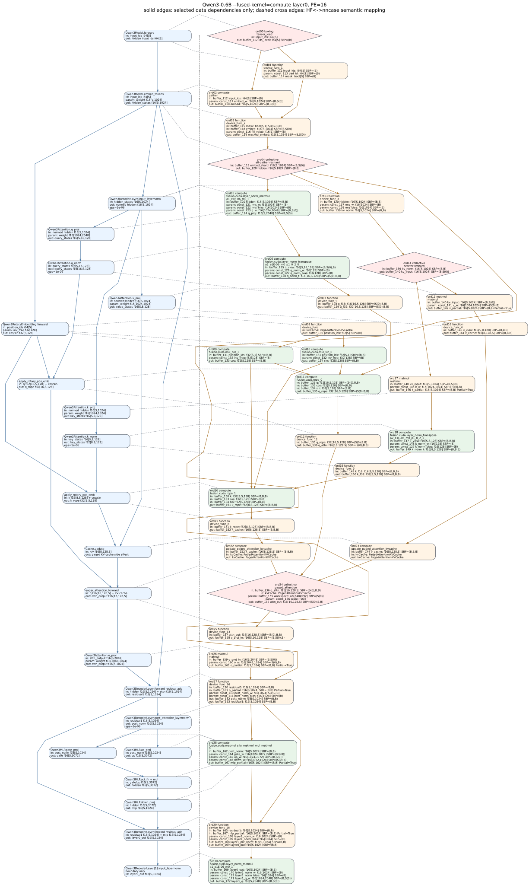

# Qwen3 `--fused-kernel=compute` Layer0 Graph

This document maps the current PE=16 compute-mode Qwen3 demo from `input_ids`,
through embedding, to the end of decoder layer 0. The graph is intentionally
browser-width and tall: nncase ops are not merged, solid edges are only selected
data dependencies, and dashed cross-column edges are semantic HF-to-nncase mappings.
Node text emphasizes input -> output shape/SBP transformations instead of raw
argument ordinals.

Source artifacts:

- `tests_output/test_qwen3_cuda_poc/cuda_admission/pe_16/CodeGen/cuda/cuda_meta.json`
- `tests_output/test_qwen3_cuda_poc/cuda_admission/pe_16/CodeGen/cuda/launch_summary.txt`
- `tests_output/test_qwen3_cuda_poc/cuda_admission/pe_16/CodeGen/cuda/triton_module.py`
- `tests/llm/Qwen/Qwen3-0.6B/config.json`
- Hugging Face Qwen3 op names: [https://github.com/huggingface/transformers/blob/main/src/transformers/models/qwen3/modeling_qwen3.py](https://github.com/huggingface/transformers/blob/main/src/transformers/models/qwen3/modeling_qwen3.py)

Metadata checks:

- `pe_count=16`
- `fused_kernel=compute`
- layer0 scope: `main_segment_0_prim` ordinal `0..29`
- ordinal `30` is shown only as the layer1 boundary

## Model Dimensions

| Symbol | Meaning | Value |
| --- | --- | --- |
| `S` | dynamic `sequence_length` | runtime dynamic |
| `V` | vocabulary size | `151936` |
| `H` | hidden size | `1024` |
| `I` | MLP intermediate size | `3072` |
| `QH` | query heads | `16` |
| `KVH` | key/value heads | `8` |
| `D` | attention head dim | `128` |
| `PE` | processing elements | `16` |

## Graph

Render command:

```bash
python docs/triton-backend/generate_qwen3_compute_layer0.py
```



Legend:

- blue rounded boxes: Hugging Face Qwen3 ops, with input -> output shapes
- orange rounded boxes: ordinary nncase lowered ops
- green rounded boxes: `fusion.cuda.*` compute fused ops
- pink diamonds: `requires_collective=true` nncase launches (`0`, `4`, `14`, `24`)

## Launch Table

| Ord | nncase op | HF mapping | Input -> output dims/SBP | Triton helper |
| --- | --- | --- | --- | --- |
| 0 | `tensor_load` | Qwen3Model.forward | in: input_ids: i64[S]<br>out: buffer_112 ids_local: i64[S] SBP=(B) | `_nncase_ccl_rank4_kernel` |
| 1 | `device_func_1` | Qwen3Model.forward | in: buffer_112 input_ids: i64[S] SBP=(B)<br>param: const_113 pad_id: i64[1] SBP=(B)<br>out: buffer_114 mask: bool[S] SBP=(B) | `_nncase_pe_binary_rank4_kernel` |
| 2 | `gather` | Qwen3Model.embed_tokens | in: buffer_112 input_ids: i64[S] SBP=(B)<br>param: const_117 embed_w: f16[V,1024] SBP=(B,S(0))<br>out: buffer_118 embed: f16[S,1024] SBP=(B,S(0)) | `_nncase_pe_gather_axis0_rank2_kernel` |
| 3 | `device_func_2` | Qwen3Model.embed_tokens | in: buffer_115 mask: bool[S,1] SBP=(B,B)<br>in: buffer_118 embed: f16[S,1024] SBP=(B,S(0))<br>param: const_116 fill_value: f16[1] SBP=(B)<br>out: buffer_119 masked_embed: f16[S,1024] SBP=(B,S(0)) | `_nncase_pe_where_rank4_kernel` |
| 4 | `all-gather reshard`<br>`gather_reduce_scatter` | Qwen3Model.embed_tokens | in: buffer_119 embed_shard: f16[S,1024] SBP=(B,S(0))<br>out: buffer_120 hidden: f16[S,1024] SBP=(B,B) | `_nncase_ccl_rank4_kernel` |
| 5 | `fusion.cuda.layer_norm_matmul_a1_e1E-06_m0_0` | Qwen3DecoderLayer.input_layernorm<br>Qwen3Attention.q_proj | in: buffer_120 hidden: f16[S,1024] SBP=(B,B)<br>param: const_121 rms_w: f16[1024] SBP=(B)<br>param: const_122 rms_bias: f16[1024] SBP=(B)<br>param: const_123 q_w: f16[1024,2048] SBP=(B,S(0))<br>out: buffer_124 q_proj: f16[S,2048] SBP=(B,S(0)) | `_nncase_pe_layer_norm_matmul_kernel` |
| 6 | `fusion.cuda.layer_norm_transpose_a2_e1E-06_m0_p1_0_2_0` | Qwen3Attention.q_norm | in: buffer_125 q_view: f16[S,16,128] SBP=(B,S(0),B)<br>param: const_126 q_norm_w: f16[128] SBP=(B)<br>param: const_127 q_norm_bias: f16[128] SBP=(B)<br>out: buffer_128 q_norm_t: f16[16,S,128] SBP=(S(0),B,B) | `_nncase_pe_layer_norm_transpose_rank4_kernel` |
| 7 | `device_func_9` | Qwen3Attention.q_norm | in: buffer_128 q_f16: f16[16,S,128] SBP=(S(0),B,B)<br>out: buffer_129 q_f32: f32[16,S,128] SBP=(S(0),B,B) | `_nncase_pe_copy_rank4_kernel` |
| 8 | `device_func` | Qwen3RotaryEmbedding.forward | in: kvCache: PagedAttentionKVCache<br>out: buffer_130 position_ids: f32[S] SBP=(B) | `_nncase_pe_position_ids_kernel` |
| 9 | `fusion.cuda.mul_cos_0` | Qwen3RotaryEmbedding.forward | in: buffer_131 position_ids: f32[S,1] SBP=(B,B)<br>param: const_132 inv_freq: f32[128] SBP=(B)<br>out: buffer_133 cos: f32[S,128] SBP=(B,B) | `_nncase_pe_mul_unary_rank4_kernel` |
| 10 | `fusion.cuda.mul_sin_0` | Qwen3RotaryEmbedding.forward | in: buffer_131 position_ids: f32[S,1] SBP=(B,B)<br>param: const_132 inv_freq: f32[128] SBP=(B)<br>out: buffer_134 sin: f32[S,128] SBP=(B,B) | `_nncase_pe_mul_unary_rank4_kernel` |
| 11 | `fusion.cuda.rope_0` | apply_rotary_pos_emb | in: buffer_129 q: f32[16,S,128] SBP=(S(0),B,B)<br>in: buffer_133 cos: f32[S,128] SBP=(B,B)<br>in: buffer_134 sin: f32[S,128] SBP=(B,B)<br>out: buffer_135 q_rope: f32[16,S,128] SBP=(S(0),B,B) | `_nncase_pe_rope_rank4_kernel` |
| 12 | `device_func_12` | apply_rotary_pos_emb | in: buffer_135 q_rope: f32[16,S,128] SBP=(S(0),B,B)<br>out: buffer_136 q_attn: f16[16,128,S] SBP=(S(0),B,B) | `_nncase_pe_transpose_rank4_kernel` |
| 13 | `device_func_3` | Qwen3DecoderLayer.input_layernorm | in: buffer_120 hidden: f16[S,1024] SBP=(B,B)<br>param: const_137 rms_w: f16[1024] SBP=(B)<br>param: const_138 rms_bias: f16[1024] SBP=(B)<br>out: buffer_139 kv_norm: f16[S,1024] SBP=(B,B) | `_nncase_pe_layer_norm_kernel` |
| 14 | `scatter reshard`<br>`gather_reduce_scatter` | K/V normalized hidden materialization | in: buffer_139 kv_norm: f16[S,1024] SBP=(B,B)<br>out: buffer_140 kv_input: f16[S,1024] SBP=(B,S(0)) | `_nncase_ccl_rank4_kernel` |
| 15 | `matmul` | Qwen3Attention.v_proj | in: buffer_140 kv_input: f16[S,1024] SBP=(B,S(0))<br>param: const_141 v_w: f16[1024,1024] SBP=(S(0),B)<br>out: buffer_142 v_partial: f16[S,1024] SBP=(B,B) Partial=True | `_nncase_pe_matmul_kernel` |
| 16 | `device_func_4` | Qwen3Attention.v_proj | in: buffer_143 v_view: f16[S,8,128] SBP=(B,B,B)<br>out: buffer_144 v_cache: f16[8,128,S] SBP=(B,B,B) | `_nncase_pe_transpose_rank4_kernel` |
| 17 | `matmul` | Qwen3Attention.k_proj | in: buffer_140 kv_input: f16[S,1024] SBP=(B,S(0))<br>param: const_145 k_w: f16[1024,1024] SBP=(S(0),B)<br>out: buffer_146 k_partial: f16[S,1024] SBP=(B,B) Partial=True | `_nncase_pe_matmul_kernel` |
| 18 | `fusion.cuda.layer_norm_transpose_a2_e1E-06_m0_p1_0_2_1` | Qwen3Attention.k_norm | in: buffer_147 k_view: f16[S,8,128] SBP=(B,B,B)<br>param: const_148 k_norm_w: f16[128] SBP=(B)<br>param: const_127 k_norm_bias: f16[128] SBP=(B)<br>out: buffer_149 k_norm_t: f16[8,S,128] SBP=(B,B,B) | `_nncase_pe_layer_norm_transpose_rank4_kernel` |
| 19 | `device_func_5` | Qwen3Attention.k_norm | in: buffer_149 k_f16: f16[8,S,128] SBP=(B,B,B)<br>out: buffer_150 k_f32: f32[8,S,128] SBP=(B,B,B) | `_nncase_pe_copy_rank4_kernel` |
| 20 | `fusion.cuda.rope_1` | apply_rotary_pos_emb | in: buffer_150 k: f32[8,S,128] SBP=(B,B,B)<br>in: buffer_133 cos: f32[S,128] SBP=(B,B)<br>in: buffer_134 sin: f32[S,128] SBP=(B,B)<br>out: buffer_151 k_rope: f32[8,S,128] SBP=(B,B,B) | `_nncase_pe_rope_rank4_kernel` |
| 21 | `device_func_8` | apply_rotary_pos_emb | in: buffer_151 k_rope: f32[8,S,128] SBP=(B,B,B)<br>out: buffer_152 k_cache: f16[8,128,S] SBP=(B,B,B) | `_nncase_pe_transpose_rank4_kernel` |
| 22 | `update_paged_attention_kvcache` | Cache.update | in: buffer_152 k_cache: f16[8,128,S] SBP=(B,B,B)<br>in: kvCache: PagedAttentionKVCache<br>out: kvCache: PagedAttentionKVCache | `_nncase_pe_update_kv_rank4_kernel` |
| 23 | `update_paged_attention_kvcache` | Cache.update | in: buffer_144 v_cache: f16[8,128,S] SBP=(B,B,B)<br>in: kvCache: PagedAttentionKVCache<br>out: kvCache: PagedAttentionKVCache | `_nncase_pe_update_kv_rank4_kernel` |
| 24 | `paged_attention` | eager_attention_forward | in: buffer_136 q_attn: f16[16,128,S] SBP=(S(0),B,B)<br>in: kvCache: PagedAttentionKVCache<br>param: buffer_155 workspace: u8[8404992] SBP=(S(0))<br>param: const_156 scale: f16[]<br>out: buffer_157 attn_out: f16[16,128,S] SBP=(S(0),B,B) | `_nncase_paged_flash_attention_rank3_kernel` |
| 25 | `device_func_13` | eager_attention_forward | in: buffer_157 attn_out: f16[16,128,S] SBP=(S(0),B,B)<br>out: buffer_158 o_proj_in: f16[S,16,128] SBP=(B,S(0),B) | `_nncase_pe_transpose_rank4_kernel` |
| 26 | `matmul` | Qwen3Attention.o_proj | in: buffer_159 o_proj_in: f16[S,2048] SBP=(B,S(0))<br>param: const_160 o_w: f16[2048,1024] SBP=(S(0),B)<br>out: buffer_161 o_partial: f16[S,1024] SBP=(B,B) Partial=True | `_nncase_pe_matmul_kernel` |
| 27 | `device_func_16` | Qwen3DecoderLayer.forward residual add<br>Qwen3DecoderLayer.post_attention_layernorm | in: buffer_120 residual0: f16[S,1024] SBP=(B,B)<br>in: buffer_161 o_partial: f16[S,1024] SBP=(B,B) Partial=True<br>param: const_110 post_norm_w: f16[1024] SBP=(B)<br>param: const_111 post_norm_bias: f16[1024] SBP=(B)<br>out: buffer_162 post_norm: f16[S,1024] SBP=(B,B)<br>out: buffer_163 residual1: f16[S,1024] SBP=(B,B) | `_nncase_pe_binary_rank4_kernel + _nncase_pe_layer_norm_kernel` |
| 28 | `fusion.cuda.matmul_silu_matmul_mul_matmul_0` | Qwen3MLP.gate_proj<br>Qwen3MLP.up_proj<br>Qwen3MLP.act_fn + mul<br>Qwen3MLP.down_proj | in: buffer_162 post_norm: f16[S,1024] SBP=(B,B)<br>param: const_164 gate_w: f16[1024,3072] SBP=(B,S(0))<br>param: const_165 up_w: f16[1024,3072] SBP=(B,S(0))<br>param: const_166 down_w: f16[3072,1024] SBP=(S(0),B)<br>out: buffer_167 mlp_partial: f16[S,1024] SBP=(B,B) Partial=True | `_nncase_pe_matmul_silu_matmul_mul_matmul_kernel` |
| 29 | `device_func_16` | Qwen3DecoderLayer.forward residual add | in: buffer_163 residual1: f16[S,1024] SBP=(B,B)<br>in: buffer_167 mlp_partial: f16[S,1024] SBP=(B,B) Partial=True<br>param: const_108 layer1_norm_w: f16[1024] SBP=(B)<br>param: const_109 layer1_norm_bias: f16[1024] SBP=(B)<br>out: buffer_168 layer1_pre_norm: f16[S,1024] SBP=(B,B)<br>out: buffer_169 layer0_out: f16[S,1024] SBP=(B,B) | `_nncase_pe_binary_rank4_kernel + _nncase_pe_layer_norm_kernel` |
| 30 | `fusion.cuda.layer_norm_matmul_a1_e1E-06_m0_1` | Qwen3DecoderLayer[1].input_layernorm | in: buffer_169 layer0_out: f16[S,1024] SBP=(B,B)<br>param: const_170 layer1_norm_w: f16[1024] SBP=(B)<br>param: const_122 layer1_norm_bias: f16[1024] SBP=(B)<br>param: const_171 layer1_q_w: f16[1024,2048] SBP=(B,S(0))<br>out: buffer_172 layer1_q: f16[S,2048] SBP=(B,S(0)) | `_nncase_pe_layer_norm_matmul_kernel` |

## Data-Dependency Policy

The graph follows the selected `main data flow + key branch dependencies` policy.
It keeps Q/K/V, RoPE, KV-cache update, paged attention, residual, and MLP data
dependencies. Auxiliary constant, mask, workspace, and `dim_var` dependencies are
kept in the table but not drawn as solid graph edges.

## Compute Fusions Present

- `fusion.cuda.layer_norm_matmul`
- `fusion.cuda.layer_norm_transpose`
- `fusion.cuda.mul_cos`
- `fusion.cuda.mul_sin`
- `fusion.cuda.rope`
- `fusion.cuda.matmul_silu_matmul_mul_matmul`

## Boundary Note

Ordinal `29` calls `device_func_16` for the MLP residual. It also produces the
next layer's pre-norm side output, but the layer0 main output ends at `buffer_169`.
Ordinal `30` is included only to mark the layer1 boundary.
