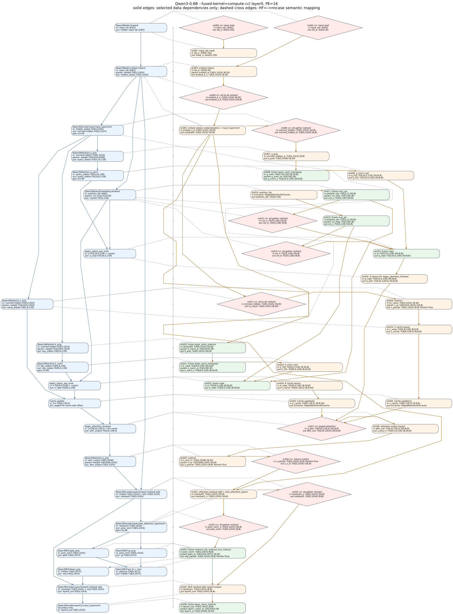

# Qwen3 `--fused-kernel=compute-ccl` Layer0 Graph

This document maps the PE=16 `compute-ccl` Qwen3 demo from `input_ids`,
through embedding, to the end of decoder layer 0. It uses the same visual
rules as the existing compute-mode graph: nncase ops are not merged, solid
edges are only selected data dependencies, and dashed cross-column edges are
semantic HF-to-nncase mappings.

Source artifacts:

- `tests_output/qwen3_reshard_compute_ccl_probe/cuda_admission/pe_16/CodeGen/cuda/cuda_meta.json`
- `tests_output/qwen3_reshard_compute_ccl_probe/cuda_admission/pe_16/CodeGen/cuda/launch_summary.txt`
- `tests_output/qwen3_reshard_compute_ccl_probe/cuda_admission/pe_16/CodeGen/cuda/triton_module.py`
- `tests/llm/Qwen/Qwen3-0.6B/config.json`
- Hugging Face Qwen3 op names: [https://github.com/huggingface/transformers/blob/main/src/transformers/models/qwen3/modeling_qwen3.py](https://github.com/huggingface/transformers/blob/main/src/transformers/models/qwen3/modeling_qwen3.py)

Metadata checks:

- `pe_count=16`
- `fused_kernel=compute-ccl`
- layer0 scope: `main_segment_1_prim` ordinal `0..35`
- ordinal `36` is shown only as the layer1 boundary

## Model Dimensions

| Symbol | Meaning | Value |
| --- | --- | --- |
| `S` | dynamic `sequence_length` | runtime dynamic |
| `V` | vocabulary size | `151936` |
| `H` | hidden size | `1024` |
| `I` | MLP intermediate size | `3072` |
| `QH` | query heads | `16` |
| `KVH` | key/value heads | `8` |
| `D` | attention head dim | `128` |
| `PE` | processing elements | `16` |

## Graph

Render command:

```bash
python docs/triton-backend/qwen3-layer0-fused-modes/generate_qwen3_layer0_fused_modes.py
```



Legend:

- blue rounded boxes: Hugging Face Qwen3 ops, with input -> output shapes
- orange rounded boxes: ordinary nncase lowered ops
- green rounded boxes: `fusion.cuda.*` compute fused ops
- pink diamonds: `requires_collective=true` nncase launches (0, 2, 4, 6, 12, 14, 17, 27, 30, 32, 33)
- grey rounded box: layer1 boundary ordinal

## Segment Note

- The graph above intentionally follows `main_segment_1_prim` because this segment contains the requested ord04 all-to-all reshard.
- ord04 in this graph: `main_segment_1_prim` ord04: `gather_reduce_scatter` `f16[S,1024] SBP=(B,S(0))` -> `f16[S,1024] SBP=(S(0),B)`
- collective nodes use semantic display names in the graph; the launch table keeps the raw nncase op name.

## Launch Table

| Ord | nncase op | HF mapping | Input -> output dims/SBP | Triton helper |
| --- | --- | --- | --- | --- |
| 0 | `input load`<br>`tensor_load` | Qwen3Model.forward | in: input_ids: i64[S]<br>out: buffer_114 ids_s: i64[S] SBP=(S(0)) | `_nncase_ccl_rank4_kernel` |
| 1 | `device_func_458` | Qwen3Model.forward | in: buffer_114 ids_s: i64[S] SBP=(S(0))<br>param: const_115 pad_id: i64[1] SBP=(B)<br>out: buffer_116 mask_s: bool[S] SBP=(S(0)) | `triton_module.py::device_func_458` |
| 2 | `input load`<br>`tensor_load` | Qwen3Model.forward | in: input_ids: i64[S]<br>out: buffer_120 ids_b: i64[S] SBP=(B) | `_nncase_ccl_rank4_kernel` |
| 3 | `gather` | Qwen3Model.embed_tokens | in: buffer_120 ids_b: i64[S] SBP=(B)<br>param: const_119 embed_w: f16[V,1024] SBP=(B,S(0))<br>out: buffer_121 embed_b_s: f16[S,1024] SBP=(B,S(0)) | `_nncase_pe_gather_axis0_rank2_kernel` |
| 4 | `all-to-all reshard`<br>`gather_reduce_scatter` | Qwen3Model.embed_tokens | in: buffer_121 embed_b_s: f16[S,1024] SBP=(B,S(0))<br>out: buffer_122 embed_s_b: f16[S,1024] SBP=(S(0),B) | `_nncase_ccl_rank4_kernel` |
| 5 | `device_func_461` | Qwen3Model.embed_tokens<br>Qwen3DecoderLayer.input_layernorm | in: buffer_122 embed_s_b: f16[S,1024] SBP=(S(0),B)<br>in: buffer_117 mask_s: bool[S,1] SBP=(S(0),B)<br>param: const_112 rms_w: f16[1024] SBP=(B)<br>param: const_113 rms_bias: f16[1024] SBP=(B)<br>param: const_118 fill_value: f16[1] SBP=(B)<br>out: buffer_123 normed_hidden: f16[S,1024] SBP=(S(0),B)<br>out: buffer_124 residual0: f16[S,1024] SBP=(S(0),B) | `triton_module.py::device_func_461` |
| 6 | `all-gather reshard`<br>`gather_reduce_scatter` | Qwen3DecoderLayer.input_layernorm | in: buffer_123 normed_hidden: f16[S,1024] SBP=(S(0),B)<br>out: buffer_125 normed_hidden_b: f16[S,1024] SBP=(B,B) | `_nncase_ccl_rank4_kernel` |
| 7 | `device_func_463` | Qwen3Attention.q_proj | in: buffer_125 normed_hidden_b: f16[S,1024] SBP=(B,B)<br>param: const_126 q_w: f16[1024,2048] SBP=(B,S(0))<br>out: buffer_127 q_proj: f16[S,2048] SBP=(B,S(0)) | `triton_module.py::device_func_463` |
| 8 | `fusion.cuda.layer_norm_transpose_a2_e1E-06_m0_p1_0_2_56` | Qwen3Attention.q_norm | in: buffer_128 q_view: f16[S,16,128] SBP=(B,S(0),B)<br>param: const_129 q_norm_w: f16[128] SBP=(B)<br>param: const_130 q_norm_bias: f16[128] SBP=(B)<br>out: buffer_131 q_norm_t: f16[16,S,128] SBP=(S(0),B,B) | `_nncase_pe_layer_norm_transpose_rank4_kernel` |
| 9 | `device_func_464` | Qwen3Attention.q_norm | in: buffer_131 q_f16: f16[16,S,128] SBP=(S(0),B,B)<br>out: buffer_132 q_f32: f32[16,S,128] SBP=(S(0),B,B) | `triton_module.py::device_func_464` |
| 10 | `device_func_457` | Qwen3RotaryEmbedding.forward | in: kvCache: PagedAttentionKVCache<br>out: buffer_133 position_ids: f32[S] SBP=(S(0)) | `triton_module.py::device_func_457` |
| 11 | `fusion.cuda.mul_cos_1` | Qwen3RotaryEmbedding.forward | in: buffer_134 position_ids: f32[S,1] SBP=(S(0),B)<br>param: const_135 inv_freq: f32[128] SBP=(B)<br>out: buffer_136 cos_s: f32[S,128] SBP=(S(0),B) | `_nncase_pe_mul_unary_rank4_kernel` |
| 12 | `all-gather reshard`<br>`gather_reduce_scatter` | Qwen3RotaryEmbedding.forward | in: buffer_136 cos_s: f32[S,128] SBP=(S(0),B)<br>out: buffer_137 cos_b: f32[S,128] SBP=(B,B) | `_nncase_ccl_rank4_kernel` |
| 13 | `fusion.cuda.mul_sin_1` | Qwen3RotaryEmbedding.forward | in: buffer_134 position_ids: f32[S,1] SBP=(S(0),B)<br>param: const_135 inv_freq: f32[128] SBP=(B)<br>out: buffer_138 sin_s: f32[S,128] SBP=(S(0),B) | `_nncase_pe_mul_unary_rank4_kernel` |
| 14 | `all-gather reshard`<br>`gather_reduce_scatter` | Qwen3RotaryEmbedding.forward | in: buffer_138 sin_s: f32[S,128] SBP=(S(0),B)<br>out: buffer_139 sin_b: f32[S,128] SBP=(B,B) | `_nncase_ccl_rank4_kernel` |
| 15 | `fusion.cuda.rope_56` | apply_rotary_pos_emb | in: buffer_132 q: f32[16,S,128] SBP=(S(0),B,B)<br>in: buffer_137 cos_b: f32[S,128] SBP=(B,B)<br>in: buffer_139 sin_b: f32[S,128] SBP=(B,B)<br>out: buffer_140 q_rope: f32[16,S,128] SBP=(S(0),B,B) | `_nncase_pe_rope_rank4_kernel` |
| 16 | `device_func_467` | apply_rotary_pos_emb | in: buffer_140 q_rope: f32[16,S,128] SBP=(S(0),B,B)<br>out: buffer_141 q_attn: f16[16,128,S] SBP=(S(0),B,B) | `triton_module.py::device_func_467` |
| 17 | `all-to-all reshard`<br>`gather_reduce_scatter` | Qwen3Attention.v_proj | in: buffer_123 normed_hidden: f16[S,1024] SBP=(S(0),B)<br>out: buffer_142 kv_input: f16[S,1024] SBP=(B,S(0)) | `_nncase_ccl_rank4_kernel` |
| 18 | `matmul` | Qwen3Attention.v_proj | in: buffer_142 kv_input: f16[S,1024] SBP=(B,S(0))<br>param: const_143 v_w: f16[1024,1024] SBP=(S(0),B)<br>out: buffer_144 v_partial: f16[S,1024] SBP=(B,B) Partial=True | `_nncase_pe_matmul_kernel` |
| 19 | `device_func_462` | Qwen3Attention.v_proj | in: buffer_145 v_view: f16[S,8,128] SBP=(B,B,B)<br>out: buffer_146 v_cache: f16[8,128,S] SBP=(B,B,B) | `triton_module.py::device_func_462` |
| 20 | `fusion.cuda.layer_norm_matmul_a1_e1E-06_m0_28` | Qwen3DecoderLayer.input_layernorm<br>Qwen3Attention.k_proj | in: buffer_124 residual0: f16[S,1024] SBP=(S(0),B)<br>param: const_147 k_norm_w: f16[1024] SBP=(B)<br>param: const_148 k_norm_bias: f16[1024] SBP=(B)<br>param: const_149 k_w: f16[1024,1024] SBP=(B,B)<br>out: buffer_150 k_proj: f16[S,1024] SBP=(S(0),B) | `_nncase_pe_layer_norm_matmul_kernel` |
| 21 | `fusion.cuda.layer_norm_transpose_a2_e1E-06_m0_p1_0_2_57` | Qwen3Attention.k_norm | in: buffer_151 k_view: f16[S,8,128] SBP=(S(0),B,B)<br>param: const_152 k_norm_w: f16[128] SBP=(B)<br>param: const_130 k_norm_bias: f16[128] SBP=(B)<br>out: buffer_153 k_norm_t: f16[8,S,128] SBP=(B,S(0),B) | `_nncase_pe_layer_norm_transpose_rank4_kernel` |
| 22 | `device_func_468` | Qwen3Attention.k_norm | in: buffer_153 k_f16: f16[8,S,128] SBP=(B,S(0),B)<br>out: buffer_154 k_f32: f32[8,S,128] SBP=(B,S(0),B) | `triton_module.py::device_func_468` |
| 23 | `fusion.cuda.rope_57` | apply_rotary_pos_emb | in: buffer_154 k: f32[8,S,128] SBP=(B,S(0),B)<br>in: buffer_136 cos_s: f32[S,128] SBP=(S(0),B)<br>in: buffer_138 sin_s: f32[S,128] SBP=(S(0),B)<br>out: buffer_155 k_rope: f32[8,S,128] SBP=(B,S(0),B) | `_nncase_pe_rope_rank4_kernel` |
| 24 | `device_func_471` | apply_rotary_pos_emb | in: buffer_155 k_rope: f32[8,S,128] SBP=(B,S(0),B)<br>out: buffer_156 k_cache: f16[8,128,S] SBP=(B,B,S(0)) | `triton_module.py::device_func_471` |
| 25 | `update_paged_attention_kvcache` | Cache.update | in: buffer_156 k_cache: f16[8,128,S] SBP=(B,B,S(0))<br>in: kvCache: PagedAttentionKVCache<br>out: kvCache: PagedAttentionKVCache | `_nncase_pe_update_kv_rank4_kernel` |
| 26 | `update_paged_attention_kvcache` | Cache.update | in: buffer_146 v_cache: f16[8,128,S] SBP=(B,B,B)<br>in: kvCache: PagedAttentionKVCache<br>out: kvCache: PagedAttentionKVCache | `_nncase_pe_update_kv_rank4_kernel` |
| 27 | `paged attention`<br>`paged_attention` | eager_attention_forward | in: buffer_141 q_attn: f16[16,128,S] SBP=(S(0),B,B)<br>in: kvCache: PagedAttentionKVCache<br>param: buffer_159 workspace: u8[8404992] SBP=(S(0))<br>param: const_160 scale: f16[]<br>out: buffer_161 attn_out: f16[16,128,S] SBP=(S(0),B,B) | `_nncase_paged_flash_attention_rank3_kernel` |
| 28 | `device_func_472` | eager_attention_forward | in: buffer_161 attn_out: f16[16,128,S] SBP=(S(0),B,B)<br>out: buffer_162 o_proj_in: f16[S,16,128] SBP=(B,S(0),B) | `triton_module.py::device_func_472` |
| 29 | `matmul` | Qwen3Attention.o_proj | in: buffer_163 o_proj_in: f16[S,2048] SBP=(B,S(0))<br>param: const_164 o_w: f16[2048,1024] SBP=(S(0),B)<br>out: buffer_165 o_partial: f16[S,1024] SBP=(B,B) Partial=True | `_nncase_pe_matmul_kernel` |
| 30 | `reduce-scatter`<br>`gather_reduce_scatter` | Qwen3Attention.o_proj | in: buffer_165 o_partial: f16[S,1024] SBP=(B,B) Partial=True<br>out: buffer_166 o_s_b: f16[S,1024] SBP=(S(0),B) | `_nncase_ccl_rank4_kernel` |
| 31 | `device_func_475` | Qwen3DecoderLayer.forward residual add<br>Qwen3DecoderLayer.post_attention_layernorm | in: buffer_124 residual0: f16[S,1024] SBP=(S(0),B)<br>in: buffer_166 o_s_b: f16[S,1024] SBP=(S(0),B)<br>param: const_110 post_norm_w: f16[1024] SBP=(B)<br>param: const_111 post_norm_bias: f16[1024] SBP=(B)<br>out: buffer_167 post_norm_s: f16[S,1024] SBP=(S(0),B)<br>out: buffer_168 residual1_s: f16[S,1024] SBP=(S(0),B) | `triton_module.py::device_func_475` |
| 32 | `all-gather reshard`<br>`gather_reduce_scatter` | Qwen3DecoderLayer.forward residual add | in: buffer_168 residual1_s: f16[S,1024] SBP=(S(0),B)<br>out: buffer_169 residual1: f16[S,1024] SBP=(B,B) | `_nncase_ccl_rank4_kernel` |
| 33 | `all-gather reshard`<br>`gather_reduce_scatter` | Qwen3DecoderLayer.post_attention_layernorm | in: buffer_167 post_norm_s: f16[S,1024] SBP=(S(0),B)<br>out: buffer_170 post_norm: f16[S,1024] SBP=(B,B) | `_nncase_ccl_rank4_kernel` |
| 34 | `fusion.cuda.matmul_silu_matmul_mul_matmul_28` | Qwen3MLP.gate_proj<br>Qwen3MLP.up_proj<br>Qwen3MLP.act_fn + mul<br>Qwen3MLP.down_proj | in: buffer_170 post_norm: f16[S,1024] SBP=(B,B)<br>param: const_171 gate_w: f16[1024,3072] SBP=(B,S(0))<br>param: const_172 up_w: f16[1024,3072] SBP=(B,S(0))<br>param: const_173 down_w: f16[3072,1024] SBP=(S(0),B)<br>out: buffer_174 mlp_partial: f16[S,1024] SBP=(B,B) Partial=True | `_nncase_pe_matmul_silu_matmul_mul_matmul_kernel` |
| 35 | `device_func_478` | Qwen3DecoderLayer.forward residual add<br>Qwen3DecoderLayer[1].input_layernorm | in: buffer_169 residual1: f16[S,1024] SBP=(B,B)<br>in: buffer_174 mlp_partial: f16[S,1024] SBP=(B,B) Partial=True<br>param: const_108 layer1_norm_w: f16[1024] SBP=(B)<br>param: const_109 layer1_norm_bias: f16[1024] SBP=(B)<br>out: buffer_175 layer1_pre_norm: f16[S,1024] SBP=(B,B)<br>out: buffer_176 layer0_out: f16[S,1024] SBP=(B,B) | `triton_module.py::device_func_478` |
| 36 | `fusion.cuda.layer_norm_matmul_a1_e1E-06_m0_29` | Qwen3DecoderLayer[1].input_layernorm | in: buffer_176 layer0_out: f16[S,1024] SBP=(B,B)<br>param: const_177 layer1_norm_w: f16[1024] SBP=(B)<br>param: const_148 layer1_norm_bias: f16[1024] SBP=(B)<br>param: const_178 layer1_q_w: f16[1024,2048] SBP=(B,S(0))<br>out: buffer_179 layer1_q: f16[S,2048] SBP=(B,S(0)) | `_nncase_pe_layer_norm_matmul_kernel` |

## Data-Dependency Policy

The graph follows the selected `main data flow + key branch dependencies` policy.
It keeps Q/K/V, RoPE, KV-cache update, paged attention, residual, and MLP data
dependencies. Auxiliary constant, mask, workspace, and `dim_var` dependencies are
kept in the table but not drawn as solid graph edges.

## Fusions Present

- `fusion.cuda.layer_norm_matmul`
- `fusion.cuda.layer_norm_transpose`
- `fusion.cuda.matmul_silu_matmul_mul_matmul`
- `fusion.cuda.mul_cos`
- `fusion.cuda.mul_sin`
- `fusion.cuda.rope`

## Boundary Note

Ordinal `35` contains the layer0 main output. Any following ordinal
is included only to mark the layer1 boundary or side output.
