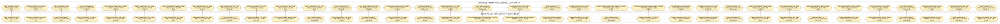

# Qwen3 Default No-Cap vs Default Cap Layer0 Shard Comparison

This file is generated from `cuda_meta.json` for the two complete Qwen3 CUDA PE=16 runs.

Changed output distributed-type ordinals in `main_segment_1_prim` ord0..34:

`0, 1, 2, 3, 4, 5, 6, 7, 9, 10, 11, 12, 13, 14, 15, 17, 18, 19, 20, 21, 22, 23, 24, 26, 27, 28, 29, 30, 32, 33, 34`

| Ord | default no-cap op | default no-cap output distributed type | default cap op | default cap output distributed type |
| --- | --- | --- | --- | --- |
| 0 | `boxing/tensor_load` | `i64[sequence_length], (B), [p:16], Partial: False` | `boxing/tensor_load` | `i64[sequence_length], (S(0)), [p:16], Partial: False` |
| 1 | `function/device_func_6569` | `bool[sequence_length], (B), [p:16], Partial: False` | `function/device_func_6803` | `bool[sequence_length], (S(0)), [p:16], Partial: False` |
| 2 | `compute/gather` | `f16[sequence_length,1024], (B,B), [p:16], Partial: False` | `boxing/tensor_load` | `i64[sequence_length], (B), [p:16], Partial: False` |
| 3 | `function/device_func_6577` | `f16[sequence_length,1024], (B,B), [p:16], Partial: False` | `compute/gather` | `f16[sequence_length,1024], (B,S(0)), [p:16], Partial: False` |
| 4 | `function/device_func_6594` | `f32[16,sequence_length,128], (S(0),B,B), [p:16], Partial: False` | `collective/gather_reduce_scatter` | `f16[sequence_length,1024], (S(0),B), [p:16], Partial: False` |
| 5 | `function/device_func_6595` | `f32[sequence_length], (B), [p:16], Partial: False` | `function/device_func_6806` | `f16[sequence_length,1024], (S(0),B), [p:16], Partial: False` |
| 6 | `function/device_func_6599` | `f32[sequence_length,128], (B,B), [p:16], Partial: False` | `collective/gather_reduce_scatter` | `f16[sequence_length,1024], (B,B), [p:16], Partial: False` |
| 7 | `function/device_func_6597` | `f32[sequence_length,128], (B,B), [p:16], Partial: False` | `function/device_func_6808` | `f16[sequence_length,2048], (B,S(0)), [p:16], Partial: False` |
| 8 | `compute/ro_pe` | `f32[16,sequence_length,128], (S(0),B,B), [p:16], Partial: False` | `function/device_func_6827` | `f32[16,sequence_length,128], (S(0),B,B), [p:16], Partial: False` |
| 9 | `function/device_func_6605` | `f16[16,128,sequence_length], (S(0),B,B), [p:16], Partial: False` | `function/device_func_6795` | `f32[sequence_length], (B), [p:16], Partial: False` |
| 10 | `collective/gather_reduce_scatter` | `f16[sequence_length,1024], (B,S(0)), [p:16], Partial: False` | `function/device_func_6799` | `f32[sequence_length,128], (B,B), [p:16], Partial: False` |
| 11 | `matmul/matmul` | `f16[sequence_length,1024], (B,B), [p:16], Partial: True` | `function/device_func_6797` | `f32[sequence_length,128], (B,B), [p:16], Partial: False` |
| 12 | `function/device_func_6578` | `f16[8,128,sequence_length], (B,B,B), [p:16], Partial: False` | `compute/ro_pe` | `f32[16,sequence_length,128], (S(0),B,B), [p:16], Partial: False` |
| 13 | `matmul/matmul` | `f16[sequence_length,1024], (B,B), [p:16], Partial: True` | `function/device_func_6830` | `f16[16,128,sequence_length], (S(0),B,B), [p:16], Partial: False` |
| 14 | `function/device_func_6586` | `f32[8,sequence_length,128], (B,B,B), [p:16], Partial: False` | `collective/gather_reduce_scatter` | `f16[sequence_length,1024], (B,S(0)), [p:16], Partial: False` |
| 15 | `compute/ro_pe` | `f32[8,sequence_length,128], (B,B,B), [p:16], Partial: False` | `matmul/matmul` | `f16[sequence_length,1024], (B,B), [p:16], Partial: True` |
| 16 | `function/device_func_6608` | `f16[8,128,sequence_length], (B,B,B), [p:16], Partial: False` | `function/device_func_6807` | `f16[8,128,sequence_length], (B,B,B), [p:16], Partial: False` |
| 17 | `compute/update_paged_attention_kvcache` | `f16[8,128,sequence_length], (B,B,B), [p:16], Partial: False` | `matmul/matmul` | `f16[sequence_length,1024], (B,B), [p:16], Partial: True` |
| 18 | `compute/update_paged_attention_kvcache` | `f16[8,128,sequence_length], (B,B,B), [p:16], Partial: False` | `function/device_func_6816` | `f32[8,sequence_length,128], (B,B,B), [p:16], Partial: False` |
| 19 | `collective/paged_attention` | `f16[16,128,sequence_length], (S(0),B,B), [p:16], Partial: False` | `compute/ro_pe` | `f32[8,sequence_length,128], (B,B,B), [p:16], Partial: False` |
| 20 | `function/device_func_6609` | `f16[sequence_length,16,128], (B,S(0),B), [p:16], Partial: False` | `function/device_func_6819` | `f16[8,128,sequence_length], (B,B,B), [p:16], Partial: False` |
| 21 | `matmul/matmul` | `f16[sequence_length,1024], (B,B), [p:16], Partial: True` | `compute/update_paged_attention_kvcache` | `f16[8,128,sequence_length], (B,B,B), [p:16], Partial: False` |
| 22 | `function/device_func_6694` | `f16[sequence_length,1024], (B,B), [p:16], Partial: False` | `compute/update_paged_attention_kvcache` | `f16[8,128,sequence_length], (B,B,B), [p:16], Partial: False` |
| 23 | `function/device_func_6612` | `f16[sequence_length,3072], (B,S(0)), [p:16], Partial: False` | `collective/paged_attention` | `f16[16,128,sequence_length], (S(0),B,B), [p:16], Partial: False` |
| 24 | `function/device_func_6630` | `f16[sequence_length,3072], (B,S(0)), [p:16], Partial: False` | `function/device_func_6831` | `f16[sequence_length,16,128], (B,S(0),B), [p:16], Partial: False` |
| 25 | `matmul/matmul` | `f16[sequence_length,1024], (B,B), [p:16], Partial: True` | `matmul/matmul` | `f16[sequence_length,1024], (B,B), [p:16], Partial: True` |
| 26 | `function/device_func_6825` | `f16[sequence_length,1024], (B,B), [p:16], Partial: False` | `collective/gather_reduce_scatter` | `f16[sequence_length,1024], (S(0),B), [p:16], Partial: False` |
| 27 | `function/device_func_6594` | `f32[16,sequence_length,128], (S(0),B,B), [p:16], Partial: False` | `function/device_func_6834` | `f16[sequence_length,1024], (S(0),B), [p:16], Partial: False` |
| 28 | `compute/ro_pe` | `f32[16,sequence_length,128], (S(0),B,B), [p:16], Partial: False` | `collective/gather_reduce_scatter` | `f16[sequence_length,1024], (B,B), [p:16], Partial: False` |
| 29 | `function/device_func_6605` | `f16[16,128,sequence_length], (S(0),B,B), [p:16], Partial: False` | `collective/gather_reduce_scatter` | `f16[sequence_length,1024], (B,B), [p:16], Partial: False` |
| 30 | `collective/gather_reduce_scatter` | `f16[sequence_length,1024], (B,S(0)), [p:16], Partial: False` | `function/device_func_6858` | `f16[sequence_length,3072], (B,S(0)), [p:16], Partial: False` |
| 31 | `matmul/matmul` | `f16[sequence_length,1024], (B,B), [p:16], Partial: True` | `matmul/matmul` | `f16[sequence_length,1024], (B,B), [p:16], Partial: True` |
| 32 | `function/device_func_6578` | `f16[8,128,sequence_length], (B,B,B), [p:16], Partial: False` | `function/device_func_6868` | `f16[sequence_length,1024], (B,B), [p:16], Partial: False` |
| 33 | `matmul/matmul` | `f16[sequence_length,1024], (B,B), [p:16], Partial: True` | `function/device_func_6827` | `f32[16,sequence_length,128], (S(0),B,B), [p:16], Partial: False` |
| 34 | `function/device_func_6586` | `f32[8,sequence_length,128], (B,B,B), [p:16], Partial: False` | `compute/ro_pe` | `f32[16,sequence_length,128], (S(0),B,B), [p:16], Partial: False` |
