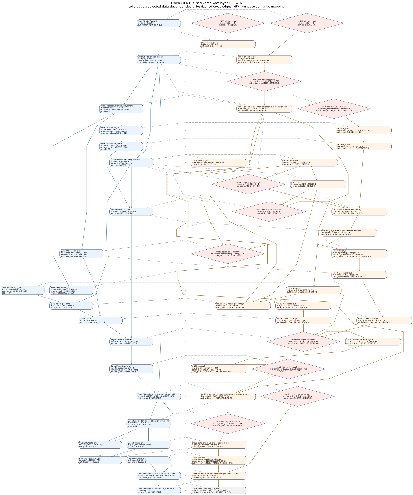

# Qwen3 `--fused-kernel=off` Layer0 Graph

This document maps the PE=16 `off` Qwen3 demo from `input_ids`,
through embedding, to the end of decoder layer 0. It uses the same visual
rules as the existing compute-mode graph: nncase ops are not merged, solid
edges are only selected data dependencies, and dashed cross-column edges are
semantic HF-to-nncase mappings.

Source artifacts:

- `tests_output/qwen3_reshard_off_probe2/cuda_admission/pe_16/CodeGen/cuda/cuda_meta.json`
- `tests_output/qwen3_reshard_off_probe2/cuda_admission/pe_16/CodeGen/cuda/launch_summary.txt`
- `tests_output/qwen3_reshard_off_probe2/cuda_admission/pe_16/CodeGen/cuda/triton_module.py`
- `tests/llm/Qwen/Qwen3-0.6B/config.json`
- Hugging Face Qwen3 op names: [https://github.com/huggingface/transformers/blob/main/src/transformers/models/qwen3/modeling_qwen3.py](https://github.com/huggingface/transformers/blob/main/src/transformers/models/qwen3/modeling_qwen3.py)

Metadata checks:

- `pe_count=16`
- `fused_kernel=off`
- layer0 scope: `main_segment_1_prim` ordinal `0..33`
- ordinal `34` is shown only as the layer1 boundary

## Model Dimensions

| Symbol | Meaning | Value |
| --- | --- | --- |
| `S` | dynamic `sequence_length` | runtime dynamic |
| `V` | vocabulary size | `151936` |
| `H` | hidden size | `1024` |
| `I` | MLP intermediate size | `3072` |
| `QH` | query heads | `16` |
| `KVH` | key/value heads | `8` |
| `D` | attention head dim | `128` |
| `PE` | processing elements | `16` |

## Graph

Render command:

```bash
python docs/triton-backend/qwen3-layer0-fused-modes/generate_qwen3_layer0_fused_modes.py
```



Legend:

- blue rounded boxes: Hugging Face Qwen3 ops, with input -> output shapes
- orange rounded boxes: ordinary nncase lowered ops
- green rounded boxes: `fusion.cuda.*` compute fused ops (none in this graph)
- pink diamonds: `requires_collective=true` nncase launches (0, 2, 4, 6, 11, 13, 16, 24, 27, 29, 30)
- dashed grey diamonds: explicit CCL launches elided by a producer-side `ccl_tail.*.grs`
- grey rounded box: layer1 boundary ordinal

## Segment Note

- The graph above intentionally follows `main_segment_1_prim` because this segment contains the requested ord04 all-to-all reshard.
- ord04 in this graph: `main_segment_1_prim` ord04: `gather_reduce_scatter` `f16[S,1024] SBP=(B,S(0))` -> `f16[S,1024] SBP=(S(0),B)`
- collective nodes use semantic display names in the graph; the launch table keeps the raw nncase op name.

## Launch Table

| Ord | nncase op | HF mapping | Input -> output dims/SBP | Triton helper |
| --- | --- | --- | --- | --- |
| 0 | `input load`<br>`tensor_load` | Qwen3Model.forward | in: input_ids: i64[S]<br>out: buffer_169 ids_s: i64[S] SBP=(S(0)) | `_nncase_ccl_rank4_kernel` |
| 1 | `device_func_6573` | Qwen3Model.forward | in: buffer_169 ids_s: i64[S] SBP=(S(0))<br>param: const_170 pad_id: i64[1] SBP=(B)<br>out: buffer_171 mask_s: bool[S] SBP=(S(0)) | `triton_module.py::device_func_6573` |
| 2 | `input load`<br>`tensor_load` | Qwen3Model.forward | in: input_ids: i64[S]<br>out: buffer_175 ids_b: i64[S] SBP=(B) | `_nncase_ccl_rank4_kernel` |
| 3 | `gather` | Qwen3Model.embed_tokens | in: buffer_175 ids_b: i64[S] SBP=(B)<br>param: const_174 embed_w: f16[V,1024] SBP=(B,S(0))<br>out: buffer_176 embed_b_s: f16[S,1024] SBP=(B,S(0)) | `_nncase_pe_gather_axis0_rank2_kernel` |
| 4 | `all-to-all reshard`<br>`gather_reduce_scatter` | Qwen3Model.embed_tokens | in: buffer_176 embed_b_s: f16[S,1024] SBP=(B,S(0))<br>out: buffer_177 embed_s_b: f16[S,1024] SBP=(S(0),B) | `_nncase_ccl_rank4_kernel` |
| 5 | `device_func_6581` | Qwen3Model.embed_tokens<br>Qwen3DecoderLayer.input_layernorm<br>Qwen3Attention.k_proj | in: buffer_177 embed_s_b: f16[S,1024] SBP=(S(0),B)<br>in: buffer_172 mask_s: bool[S,1] SBP=(S(0),B)<br>param: const_166 k_w: f16[1024,1024] SBP=(B,B)<br>param: const_167 rms_w: f16[1024] SBP=(B)<br>param: const_168 rms_bias: f16[1024] SBP=(B)<br>param: const_173 fill_value: f16[1] SBP=(B)<br>out: buffer_178 k_proj: f16[S,1024] SBP=(S(0),B)<br>out: buffer_179 normed_hidden: f16[S,1024] SBP=(S(0),B)<br>out: buffer_180 residual0: f16[S,1024] SBP=(S(0),B) | `triton_module.py::device_func_6581` |
| 6 | `all-gather reshard`<br>`gather_reduce_scatter` | Qwen3DecoderLayer.input_layernorm | in: buffer_179 normed_hidden: f16[S,1024] SBP=(S(0),B)<br>out: buffer_181 normed_hidden_b: f16[S,1024] SBP=(B,B) | `_nncase_ccl_rank4_kernel` |
| 7 | `device_func_6594` | Qwen3Attention.q_proj | in: buffer_181 normed_hidden_b: f16[S,1024] SBP=(B,B)<br>param: const_182 q_w: f16[1024,2048] SBP=(B,S(0))<br>out: buffer_183 q_proj: f16[S,2048] SBP=(B,S(0)) | `triton_module.py::device_func_6594` |
| 8 | `device_func_6602` | Qwen3Attention.q_norm | in: buffer_184 q_view: f16[S,16,128] SBP=(B,S(0),B)<br>param: const_185 q_norm_w: f16[128] SBP=(B)<br>param: const_186 q_norm_bias: f16[128] SBP=(B)<br>out: buffer_187 q_norm_t: f32[16,S,128] SBP=(S(0),B,B) | `triton_module.py::device_func_6602` |
| 9 | `device_func_6565` | Qwen3RotaryEmbedding.forward | in: kvCache: PagedAttentionKVCache<br>out: buffer_188 position_ids: f32[S] SBP=(S(0)) | `triton_module.py::device_func_6565` |
| 10 | `device_func_6569` | Qwen3RotaryEmbedding.forward | in: buffer_189 position_ids: f32[S,1] SBP=(S(0),B)<br>param: const_190 inv_freq: f32[128] SBP=(B)<br>out: buffer_191 cos_s: f32[S,128] SBP=(S(0),B)<br>out: buffer_192 angle_s: f32[S,128] SBP=(S(0),B) | `triton_module.py::device_func_6569` |
| 11 | `all-gather reshard`<br>`gather_reduce_scatter` | Qwen3RotaryEmbedding.forward | in: buffer_191 cos_s: f32[S,128] SBP=(S(0),B)<br>out: buffer_193 cos_b: f32[S,128] SBP=(B,B) | `_nncase_ccl_rank4_kernel` |
| 12 | `device_func_6567` | Qwen3RotaryEmbedding.forward | in: buffer_192 angle_s: f32[S,128] SBP=(S(0),B)<br>out: buffer_194 sin_s: f32[S,128] SBP=(S(0),B) | `triton_module.py::device_func_6567` |
| 13 | `all-gather reshard`<br>`gather_reduce_scatter` | Qwen3RotaryEmbedding.forward | in: buffer_194 sin_s: f32[S,128] SBP=(S(0),B)<br>out: buffer_195 sin_b: f32[S,128] SBP=(B,B) | `_nncase_ccl_rank4_kernel` |
| 14 | `ro_pe` | apply_rotary_pos_emb | in: buffer_187 q: f32[16,S,128] SBP=(S(0),B,B)<br>in: buffer_193 cos_b: f32[S,128] SBP=(B,B)<br>in: buffer_195 sin_b: f32[S,128] SBP=(B,B)<br>out: buffer_196 q_rope: f32[16,S,128] SBP=(S(0),B,B) | `_nncase_pe_rope_rank4_kernel` |
| 15 | `device_func_6605` | apply_rotary_pos_emb | in: buffer_196 q_rope: f32[16,S,128] SBP=(S(0),B,B)<br>out: buffer_197 q_attn: f16[16,128,S] SBP=(S(0),B,B) | `triton_module.py::device_func_6605` |
| 16 | `all-to-all reshard`<br>`gather_reduce_scatter` | Qwen3Attention.v_proj | in: buffer_179 normed_hidden: f16[S,1024] SBP=(S(0),B)<br>out: buffer_198 kv_input: f16[S,1024] SBP=(B,S(0)) | `_nncase_ccl_rank4_kernel` |
| 17 | `matmul` | Qwen3Attention.v_proj | in: buffer_198 kv_input: f16[S,1024] SBP=(B,S(0))<br>param: const_199 v_w: f16[1024,1024] SBP=(S(0),B)<br>out: buffer_200 v_partial: f16[S,1024] SBP=(B,B) Partial=True | `_nncase_pe_matmul_kernel` |
| 18 | `device_func_6593` | Qwen3Attention.v_proj | in: buffer_201 v_view: f16[S,8,128] SBP=(B,B,B)<br>out: buffer_202 v_cache: f16[8,128,S] SBP=(B,B,B) | `triton_module.py::device_func_6593` |
| 19 | `device_func_6589` | Qwen3Attention.k_norm | in: buffer_203 k_view: f16[S,8,128] SBP=(S(0),B,B)<br>param: const_204 k_norm_w: f16[128] SBP=(B)<br>param: const_205 k_norm_bias: f16[128] SBP=(B)<br>out: buffer_206 k_norm_t: f32[8,S,128] SBP=(B,S(0),B) | `triton_module.py::device_func_6589` |
| 20 | `ro_pe` | apply_rotary_pos_emb | in: buffer_206 k: f32[8,S,128] SBP=(B,S(0),B)<br>in: buffer_191 cos_s: f32[S,128] SBP=(S(0),B)<br>in: buffer_194 sin_s: f32[S,128] SBP=(S(0),B)<br>out: buffer_207 k_rope: f32[8,S,128] SBP=(B,S(0),B) | `_nncase_pe_rope_rank4_kernel` |
| 21 | `device_func_6592` | apply_rotary_pos_emb | in: buffer_207 k_rope: f32[8,S,128] SBP=(B,S(0),B)<br>out: buffer_208 k_cache: f16[8,128,S] SBP=(B,B,S(0)) | `triton_module.py::device_func_6592` |
| 22 | `update_paged_attention_kvcache` | Cache.update | in: buffer_208 k_cache: f16[8,128,S] SBP=(B,B,S(0))<br>in: kvCache: PagedAttentionKVCache<br>out: kvCache: PagedAttentionKVCache | `_nncase_pe_update_kv_rank4_kernel` |
| 23 | `update_paged_attention_kvcache` | Cache.update | in: buffer_202 v_cache: f16[8,128,S] SBP=(B,B,B)<br>in: kvCache: PagedAttentionKVCache<br>out: kvCache: PagedAttentionKVCache | `_nncase_pe_update_kv_rank4_kernel` |
| 24 | `paged attention`<br>`paged_attention` | eager_attention_forward | in: buffer_197 q_attn: f16[16,128,S] SBP=(S(0),B,B)<br>in: kvCache: PagedAttentionKVCache<br>param: buffer_211 workspace: u8[8404992] SBP=(S(0))<br>param: const_212 scale: f16[]<br>out: buffer_213 attn_out: f16[16,128,S] SBP=(S(0),B,B) | `_nncase_paged_flash_attention_rank3_kernel` |
| 25 | `device_func_6606` | eager_attention_forward | in: buffer_213 attn_out: f16[16,128,S] SBP=(S(0),B,B)<br>out: buffer_214 o_proj_in: f16[S,16,128] SBP=(B,S(0),B) | `triton_module.py::device_func_6606` |
| 26 | `matmul` | Qwen3Attention.o_proj | in: buffer_215 o_proj_in: f16[S,2048] SBP=(B,S(0))<br>param: const_216 o_w: f16[2048,1024] SBP=(S(0),B)<br>out: buffer_217 o_partial: f16[S,1024] SBP=(B,B) Partial=True | `_nncase_pe_matmul_kernel` |
| 27 | `reduce-scatter`<br>`gather_reduce_scatter` | Qwen3Attention.o_proj | in: buffer_217 o_partial: f16[S,1024] SBP=(B,B) Partial=True<br>out: buffer_218 o_s_b: f16[S,1024] SBP=(S(0),B) | `_nncase_ccl_rank4_kernel` |
| 28 | `device_func_6609` | Qwen3DecoderLayer.forward residual add<br>Qwen3DecoderLayer.post_attention_layernorm | in: buffer_180 residual0: f16[S,1024] SBP=(S(0),B)<br>in: buffer_218 o_s_b: f16[S,1024] SBP=(S(0),B)<br>param: const_164 post_norm_w: f16[1024] SBP=(B)<br>param: const_165 post_norm_bias: f16[1024] SBP=(B)<br>out: buffer_219 post_norm_s: f16[S,1024] SBP=(S(0),B)<br>out: buffer_220 residual1_s: f16[S,1024] SBP=(S(0),B) | `triton_module.py::device_func_6609` |
| 29 | `all-gather reshard`<br>`gather_reduce_scatter` | Qwen3DecoderLayer.forward residual add | in: buffer_220 residual1_s: f16[S,1024] SBP=(S(0),B)<br>out: buffer_221 residual1: f16[S,1024] SBP=(B,B) | `_nncase_ccl_rank4_kernel` |
| 30 | `all-gather reshard`<br>`gather_reduce_scatter` | Qwen3DecoderLayer.post_attention_layernorm | in: buffer_219 post_norm_s: f16[S,1024] SBP=(S(0),B)<br>out: buffer_222 post_norm: f16[S,1024] SBP=(B,B) | `_nncase_ccl_rank4_kernel` |
| 31 | `device_func_6633` | Qwen3MLP.gate_proj<br>Qwen3MLP.up_proj<br>Qwen3MLP.act_fn + mul | in: buffer_222 post_norm: f16[S,1024] SBP=(B,B)<br>in: buffer_222 post_norm: f16[S,1024] SBP=(B,B)<br>param: const_223 gate_w: f16[1024,3072] SBP=(B,S(0))<br>param: const_224 up_w: f16[1024,3072] SBP=(B,S(0))<br>out: buffer_225 mlp_hidden: f16[S,3072] SBP=(B,S(0)) | `triton_module.py::device_func_6633` |
| 32 | `matmul` | Qwen3MLP.down_proj | in: buffer_225 mlp_hidden: f16[S,3072] SBP=(B,S(0))<br>param: const_226 down_w: f16[3072,1024] SBP=(S(0),B)<br>out: buffer_227 mlp_partial: f16[S,1024] SBP=(B,B) Partial=True | `_nncase_pe_matmul_kernel` |
| 33 | `device_func_6643` | Qwen3DecoderLayer.forward residual add<br>Qwen3DecoderLayer[1].input_layernorm | in: buffer_221 residual1: f16[S,1024] SBP=(B,B)<br>in: buffer_227 mlp_partial: f16[S,1024] SBP=(B,B) Partial=True<br>param: const_161 layer1_q_w: f16[1024,2048] SBP=(B,S(0))<br>param: const_162 layer1_norm_w: f16[1024] SBP=(B)<br>param: const_163 layer1_norm_bias: f16[1024] SBP=(B)<br>out: buffer_228 layer1_q: f16[S,2048] SBP=(B,S(0))<br>out: buffer_229 layer1_pre_norm: f16[S,1024] SBP=(B,B)<br>out: buffer_230 layer0_out: f16[S,1024] SBP=(B,B) | `triton_module.py::device_func_6643` |
| 34 | `device_func_6602` | Qwen3DecoderLayer[1].input_layernorm | in: buffer_231 layer1_q_view: f16[S,16,128] SBP=(B,S(0),B)<br>param: const_232 layer1_q_norm_w: f16[128] SBP=(B)<br>param: const_233 layer1_q_norm_bias: f16[128] SBP=(B)<br>out: buffer_234 layer1_q_norm_t: f32[16,S,128] SBP=(S(0),B,B) | `triton_module.py::device_func_6602` |

## Data-Dependency Policy

The graph follows the selected `main data flow + key branch dependencies` policy.
It keeps Q/K/V, RoPE, KV-cache update, paged attention, residual, and MLP data
dependencies. Auxiliary constant, mask, workspace, and `dim_var` dependencies are
kept in the table but not drawn as solid graph edges.

## Fusions Present

No `fusion.cuda.*` ops are present in this `off` graph.

## CCL Tail Sites

No opportunistic CCL tail sites are present in this layer0 slice.

## Boundary Note

Ordinal `33` contains the layer0 main output. Any following ordinal
is included only to mark the layer1 boundary or side output.
