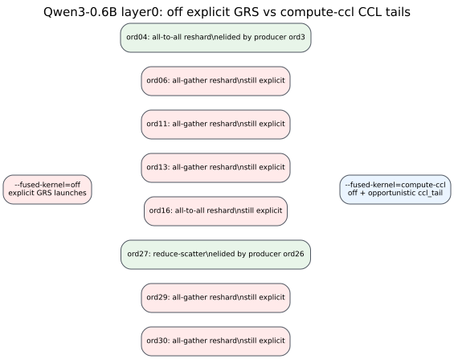

# Qwen3 `off` vs `compute-ccl` Layer0 CCL Tail Comparison

This comparison is generated from the same `tests_output` metadata as the
per-mode graphs. `compute-ccl` is expected to match `off` for compute
launches and differ only by opportunistic `gather_reduce_scatter` tail
metadata plus elided explicit GRS ordinals.

Source artifacts:

- `tests_output/qwen3_reshard_off_probe2/cuda_admission/pe_16/CodeGen/cuda/cuda_meta.json`
- `tests_output/test_qwen3_cuda_poc/cuda_admission/pe_16/CodeGen/cuda/cuda_meta.json`

| Ord | off GRS semantic | compute-ccl status | Producer |
| --- | --- | --- | --- |
| 4 | `all-to-all reshard` | elided into CCL tail | ord `3` `gather` |
| 6 | `all-gather reshard` | still explicit |  |
| 11 | `all-gather reshard` | still explicit |  |
| 13 | `all-gather reshard` | still explicit |  |
| 16 | `all-to-all reshard` | still explicit |  |
| 27 | `reduce-scatter` | elided into CCL tail | ord `26` `matmul` |
| 29 | `all-gather reshard` | still explicit |  |
| 30 | `all-gather reshard` | still explicit |  |
