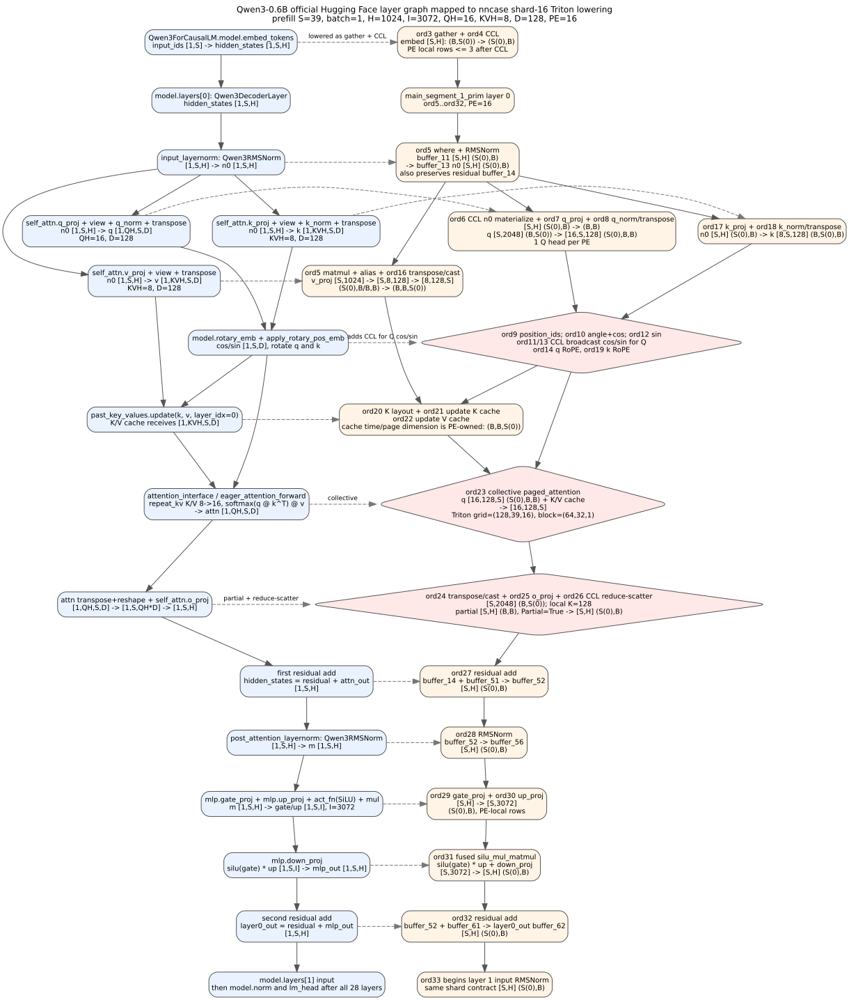
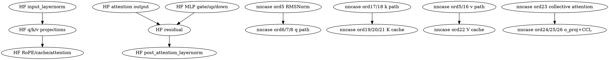

# Qwen3 Layer 0 Shard-16 Triton Log Map

This note explains how the verbose Triton log maps to one lowered Qwen3-0.6B
decoder layer after nncase SBP planning with `PE=16`.

The evidence file is:

```bash
tests_output/qwen3_triton_3tok_verbose.log
```

The useful lines are the actual generated Triton kernel lines:

```bash
grep -n '\[nncase-triton-kernel\]' tests_output/qwen3_triton_3tok_verbose.log
```

This log was generated before the high-level begin-line format was renamed to
`logical_pe_dispatch<...>`, so it still contains many high-level lines like
`launch<grid=(16, 1, 1), block=(1, 1, 1)>`. Those lines describe the logical
nncase launch boundary. They are not the physical Triton tile launch. The
physical launch is the immediately following `[nncase-triton-kernel]` line.

## Model and Shard Notation

The relevant Qwen3-0.6B dimensions are:

| Symbol | Meaning | Value |
| --- | --- | --- |
| `S` | prefill sequence length in this log | `39` |
| `H` | hidden size | `1024` |
| `I` | MLP intermediate size | `3072` |
| `QH` | query heads | `16` |
| `KVH` | key/value heads | `8` |
| `D` | head dimension | `128` |
| `PE` | simulated NUMA processing elements | `16` |

nncase distributed type notation:

| Notation | Meaning in this PoC |
| --- | --- |
| `B` | broadcast / replicated along the PE hierarchy |
| `S(0)` | shard this tensor dimension over hierarchy `p:16` |
| `Partial=True` | PE-local partial result must be reduced before normal use |
| `(S(0),B)` on `[S,H]` | each PE owns up to `ceil(39/16)=3` rows and all hidden columns |
| `(B,S(0))` on `[S,2048]` | each PE owns all rows and `2048/16=128` columns |
| `(S(0),B,B)` on `[16,S,128]` | each PE owns one query head and all tokens/head lanes |
| `(B,S(0),B)` on `[8,S,128]` | each PE owns a token shard for all KV heads |
| `(B,B,S(0))` on `[8,128,S]` | KV-cache time/cache dimension is PE-owned |

For non-CCL kernels, the last grid axis is the PE axis. The kernel reads the
PE-local pointer table entry indexed by `tl.program_id(last_axis)`. CCL kernels
are the explicit exceptions: they intentionally read multiple PE pointer-table
entries to materialize broadcast data or reduce partial data.

## Official Hugging Face Graph

The left side of the graph uses the module and operation names from the
Hugging Face `Qwen3ForCausalLM` implementation:

- `Qwen3ForCausalLM.model`
- `Qwen3Model.embed_tokens`, `Qwen3Model.layers`, `Qwen3Model.rotary_emb`,
  `Qwen3Model.norm`
- `Qwen3DecoderLayer.input_layernorm`
- `Qwen3DecoderLayer.self_attn`
- `Qwen3Attention.q_proj`, `k_proj`, `v_proj`, `o_proj`, `q_norm`, `k_norm`
- `apply_rotary_pos_emb`
- `Qwen3DecoderLayer.post_attention_layernorm`
- `Qwen3MLP.gate_proj`, `up_proj`, `down_proj`, `act_fn`

Reference sources:

- Hugging Face Transformers Qwen3 source:
  <https://github.com/huggingface/transformers/blob/main/src/transformers/models/qwen3/modeling_qwen3.py>
- Qwen/Qwen3-0.6B config:
  <https://huggingface.co/Qwen/Qwen3-0.6B/blob/main/config.json>
- Local checked model config:
  [`tests/llm/Qwen/Qwen3-0.6B/config.json`](../../tests/llm/Qwen/Qwen3-0.6B/config.json)

The official graph keeps a batch dimension. The nncase PoC compiles the Qwen3
test at batch size 1, so the lowered graph mostly uses `[S,...]` instead of the
Hugging Face `[1,S,...]` convention.

Ignoring buffer aliases and dtype casts, one official Hugging Face Qwen3 decoder
layer is:

```text
inputs_embeds = model.embed_tokens(input_ids)                     # [1,S,H]
position_embeddings = model.rotary_emb(inputs_embeds, position_ids)

residual = hidden_states
n0       = layer.input_layernorm(hidden_states)                    # [1,S,H]

q = self_attn.q_norm(self_attn.q_proj(n0).view(1,S,QH,D))          # [1,S,QH,D]
k = self_attn.k_norm(self_attn.k_proj(n0).view(1,S,KVH,D))         # [1,S,KVH,D]
v =                  self_attn.v_proj(n0).view(1,S,KVH,D)         # [1,S,KVH,D]
q = q.transpose(1, 2)                                              # [1,QH,S,D]
k = k.transpose(1, 2)                                              # [1,KVH,S,D]
v = v.transpose(1, 2)                                              # [1,KVH,S,D]
q, k = apply_rotary_pos_emb(q, k, cos, sin)
k, v = past_key_values.update(k, v, layer_idx=0)

attn = attention_interface(q, k, v, attention_mask)                # repeat_kv K/V 8->16, then [1,QH,S,D]
attn = attn.reshape(1,S,QH*D)
attn = self_attn.o_proj(attn)                                      # [1,S,H]
x1   = residual + attn

residual = x1
m        = layer.post_attention_layernorm(x1)                      # [1,S,H]
mlp      = mlp.down_proj(mlp.act_fn(mlp.gate_proj(m)) * mlp.up_proj(m))
y        = residual + mlp                                          # [1,S,H]
```

The post-bufferize schedule does not preserve the original PyTorch module
order exactly. For example, the value projection is fused into the first nested
function, while the key and query paths appear later. The dataflow and shapes
below are the authoritative lowered graph.

## Vertical Official-to-Lowered Graph

The Graphviz source is checked in as
[`qwen3-layer0-shard16.dot`](qwen3-layer0-shard16.dot). Render it with:

```bash
dot -Tsvg docs/triton-backend/qwen3-layer0-shard16.dot \
  -o docs/triton-backend/qwen3-layer0-shard16.svg
```



The layer's generated Triton kernels are collected for study in
[`qwen3-layer0-kernels/`](qwen3-layer0-kernels/).

The graph is vertical. The left column is the official Hugging Face graph. The
right column is the nncase shard-16 lowered graph. Dashed edges show the direct
semantic correspondence. Diamond nodes are explicit communication or collective
boundaries introduced by the graph compiler.



## Official-to-nncase Mapping

| Official Hugging Face op | Official tensor shape | nncase shard-16 lowering |
| --- | --- | --- |
| `model.embed_tokens` | `input_ids [1,S] -> hidden_states [1,S,H]` | ord3 gather creates `[S,H] (B,S(0))`; ord4 CCL materializes `[S,H] (S(0),B)` |
| `model.layers[0].input_layernorm` | `[1,S,H] -> [1,S,H]` | ord5 `where` + RMSNorm on `[S,H] (S(0),B)`, PE-local rows `<=3` |
| `self_attn.q_proj`, `q_norm`, `transpose` | `[1,S,H] -> [1,QH,S,D]`, QH=16 | ord6 CCL broadcasts `n0`; ord7 q matmul creates `[S,2048] (B,S(0))`; ord8 q_norm/transpose creates `[16,S,128] (S(0),B,B)` |
| `self_attn.k_proj`, `k_norm`, `transpose` | `[1,S,H] -> [1,KVH,S,D]`, KVH=8 | ord17 k matmul and ord18 k_norm/transpose create `[8,S,128] (B,S(0),B)` |
| `self_attn.v_proj`, `transpose` | `[1,S,H] -> [1,KVH,S,D]` | ord5 matmul output is aliased as value raw `[S,8,128]`; ord16 transposes/casts to `[8,128,S] (B,B,S(0))` |
| `model.rotary_emb`, `apply_rotary_pos_emb` | cos/sin `[1,S,D]` rotate q/k | ord9 position ids, ord10 angle+cos, ord12 sin; ord11/13 CCL broadcast cos/sin for Q; ord14 rotates Q, ord19 rotates K |
| `past_key_values.update` | K/V cache receives `[1,KVH,S,D]` | ord20 K layout, ord21 update K cache, ord22 update V cache; cache time/page dimension is `(B,B,S(0))` |
| `attention_interface` / eager attention | Q `[1,QH,S,D]`; K/V repeat from `[1,KVH,S,D]` to `[1,QH,S,D]` inside eager attention | ord23 `_nncase_collective_paged_attention_rank3_kernel`, grid `(128,39,16)`, block `(64,32,1)` |
| `self_attn.o_proj` | `[1,S,QH*D] -> [1,S,H]` | ord24 layout to `[S,2048] (B,S(0))`; ord25 local `o_proj` creates partial `[S,H]`; ord26 CCL reduce-scatter produces `[S,H] (S(0),B)` |
| first residual add | `[1,S,H] + [1,S,H]` | ord27 binary add on `[S,H] (S(0),B)` |
| `post_attention_layernorm` | `[1,S,H] -> [1,S,H]` | ord28 RMSNorm on `[S,H] (S(0),B)` |
| `mlp.gate_proj`, `mlp.up_proj`, `act_fn` | two `[1,S,I]` projections, `I=3072` | ord29 gate matmul and ord30 up matmul on PE-local row shards |
| `mlp.down_proj` | `silu(gate) * up [1,S,I] -> [1,S,H]` | ord31 fused `silu_mul_matmul` computes MLP down projection on `[S,3072] -> [S,H]` |
| second residual add | `[1,S,H] + [1,S,H]` | ord32 binary add; ord33 begins layer 1 with the same `[S,H] (S(0),B)` contract |

## Ordinal-by-Ordinal Map

Layer 0 in `main_segment_1_prim` starts at ordinal 5 and ends at ordinal 32.
Ordinal 33 is the RMSNorm at the start of layer 1.

| Ord | Lowered op | Official HF op / model role | Shape/distribution | Actual Triton kernel lines |
| --- | --- | --- | --- | --- |
| 5 | `device_func_6990` nested function: `where`, `layer_norm`, `matmul` | Builds the masked residual, input RMSNorm output, and the value-projection path | input/residual/norm `[S,H]`, `(S(0),B)`; value projection is later viewed as `[S,8,128]`, `(S(0),B,B)` | line 21 `where` grid `(12,16)` block `256`; line 22 RMSNorm grid `(3,16)` block `1024`; line 23 matmul grid `(1,32,16)` block `(16,32,32)`, `k=1024`, `max_m=3`, `max_n=1024` |
| 6 | `gather_reduce_scatter` CCL | Materialize `n0` for the query projection | `[S,H]`, `(S(0),B)` -> `(B,B)` | line 26 CCL grid `(156,16)` block `256`, `max_total=39936=39*1024` |
| 7 | `device_func_7005` matmul | `q_proj(n0)` | `[S,H]` `(B,B)` x `[H,2048]` `(B,S(0))` -> `[S,2048]` `(B,S(0))`; local output width `128` | line 29 matmul grid `(3,4,16)` block `(16,32,32)`, `max_m=39`, `max_n=128` |
| 8 | `device_func_7013`: layernorm, transpose, copy | `q_norm`, reshape/transpose to attention layout | `[S,16,128]` `(B,S(0),B)` -> `[16,S,128]` `(S(0),B,B)`; one Q head per PE | lines 32-34: RMSNorm grid `(39,16)` block `128`; transpose/copy grid `(20,16)` block `256` |
| 9 | `position_ids` | Generate position ids for RoPE | `[S]`, `(S(0))`; local count `<=3` | line 37 grid `(1,16)` block `256`, `max_total=3` |
| 10 | binary + unary | Compute `angle = position_ids * inv_freq`, then local `cos(angle)` | `[S,128]`, `(S(0),B)`; local elements `3*128=384`; the angle buffer also feeds ordinal 12 | lines 40-41 grid `(2,16)` block `256`, `max_total=384` |
| 11 | `gather_reduce_scatter` CCL | Broadcast cos table for query RoPE | `[S,128]`, `(S(0),B)` -> `(B,B)` | line 44 CCL grid `(20,16)` block `256`, `max_total=4992=39*128` |
| 12 | unary | `sin(position_ids * inv_freq)` local production | `[S,128]`, `(S(0),B)` | line 47 grid `(2,16)` block `256`, `max_total=384` |
| 13 | `gather_reduce_scatter` CCL | Broadcast sin table for query RoPE | `[S,128]`, `(S(0),B)` -> `(B,B)` | line 50 CCL grid `(20,16)` block `256`, `max_total=4992` |
| 14 | `ro_pe` | Apply RoPE to Q | Q `[16,S,128]`, `(S(0),B,B)` plus broadcast cos/sin `[S,128]`, `(B,B)` | line 53 grid `(20,16)` block `256`, `max_total=4992` |
| 15 | transpose | Q attention layout | `[16,S,128]` -> `[16,128,S]`, `(S(0),B,B)` | line 56 grid `(20,16)` block `256` |
| 16 | `device_func_7004` transpose/cast | Value cache layout | value raw `[S,8,128]`, `(S(0),B,B)` -> `[8,128,S]`, `(B,B,S(0))` | line 59 grid `(12,16)` block `256`, `max_total=3072=8*3*128` |
| 17 | matmul | `k_proj(n0)` | `[S,H]` `(S(0),B)` x `[H,1024]` -> `[S,1024]` `(S(0),B)` | line 62 matmul grid `(1,32,16)` block `(16,32,32)`, `max_m=3`, `max_n=1024` |
| 18 | `device_func_7001`: layernorm, transpose, copy | `k_norm`, reshape/transpose | `[S,8,128]` `(S(0),B,B)` -> `[8,S,128]` `(B,S(0),B)` | lines 65-67: RMSNorm grid `(24,16)` block `128`, where `24=8*ceil(39/16)`; transpose/copy grid `(12,16)` |
| 19 | `ro_pe` | Apply RoPE to K | K `[8,S,128]`, `(B,S(0),B)` plus local cos/sin `[S,128]`, `(S(0),B)` | line 70 grid `(12,16)` block `256`, `max_total=3072` |
| 20 | transpose | K cache layout | `[8,S,128]` -> `[8,128,S]`, `(B,B,S(0))` | line 73 grid `(12,16)` block `256` |
| 21 | `update_paged_attention_kvcache` | Write K into PE-local KV cache | `[8,128,S]`, `(B,B,S(0))` | line 76 grid `(12,16)` block `256` |
| 22 | `update_paged_attention_kvcache` | Write V into PE-local KV cache | `[8,128,S]`, `(B,B,S(0))` | line 79 grid `(12,16)` block `256` |
| 23 | `paged_attention` collective | Attention over complete K/V cache | Q `[16,128,S]`, K/V cache pages, output `[16,128,S]`; query-head PE axis plus collective cache access | line 82 grid `(128,39,16)` block `(64,32,1)`, `HEAD_DIM=128`, `BLOCK_T=64`, `BLOCK_D=32` |
| 24 | transpose/cast | Attention output back to projection layout | `[16,128,S]` -> `[S,2048]`, `(B,S(0))` | line 85 grid `(20,16)` block `256` |
| 25 | matmul | `o_proj(attn)` | `[S,2048]` `(B,S(0))` x `[2048,H]` `(S(0),B)` -> partial `[S,H]` `(B,B), Partial=True`; local reduction `k=128` | line 88 matmul grid `(3,32,16)` block `(16,32,32)`, `k=128`, `max_m=39`, `max_n=1024` |
| 26 | `gather_reduce_scatter` CCL | Reduce `o_proj` partials and scatter rows | `[S,H]` `(B,B), Partial=True` -> `(S(0),B), Partial=False` | line 91 CCL grid `(12,16)` block `256`, `reduce_partial=true` |
| 27 | binary add | Attention residual `x1 = r0 + o` | `[S,H]`, `(S(0),B)` | line 94 grid `(12,16)` block `256` |
| 28 | RMSNorm | Post-attention norm | `[S,H]`, `(S(0),B)` | line 97 grid `(3,16)` block `1024` |
| 29 | matmul | `gate_proj(m)` | `[S,H]` -> `[S,I]`, `(S(0),B)` | line 100 matmul grid `(1,96,16)` block `(16,32,32)`, `max_m=3`, `max_n=3072` |
| 30 | matmul | `up_proj(m)` | `[S,H]` -> `[S,I]`, `(S(0),B)` | line 103 same grid as gate projection |
| 31 | fused `silu_mul_matmul` | `down_proj(silu(gate) * up)` | local `[S,I]` x `[I,H]` -> `[S,H]`, `(S(0),B)` | line 106 grid `(1,32,16)` block `(16,32,32)`, `k=3072`, `max_m=3`, `max_n=1024` |
| 32 | binary add | MLP residual `y = x1 + mlp` | `[S,H]`, `(S(0),B)` | line 109 grid `(12,16)` block `256` |

## Why These CCLs Exist

The CCL nodes are not optional implementation details. They are the graph
compiler's NUMA communication decisions made visible in the lowered graph.

Ordinal 6 broadcasts the input RMSNorm output because the chosen Q projection
shards the output head dimension: the Q matmul needs the full hidden vector for
every token on each PE that owns a query-head shard.

Ordinals 11 and 13 broadcast RoPE cos/sin tables for the Q path because Q is
head-sharded after ordinal 8: each PE owns one query head for all tokens, so it
needs the full sequence's RoPE table. The K path remains sequence-sharded and
can use the local cos/sin tables directly.

Ordinal 23 is collective because paged attention must attend over the whole
valid K/V cache, even though cache pages are stored in PE-local NUMA regions.
This kernel is allowed to read multiple PE pointer-table entries.

Ordinal 26 reduces `o_proj` partial sums. The input to `o_proj` is sharded over
the query-head/output-channel axis, so each PE computes a partial contribution
to `[S,H]`. The CCL reduces those contributions and scatters the final rows
back into `(S(0),B)`.

## Reading Grid and Block Values

Representative kernel families:

| Kernel family | Grid shape | Meaning |
| --- | --- | --- |
| rank4 elementwise/copy/transpose/RoPE/update-kv | `(tiles, PE)` | each PE executes tiles over its local tensor slice |
| layer norm | `(rows, PE)` | one program per local row/head row; block is normalized column count |
| matmul | `(M_tiles, N_tiles, PE)` | PE-local matmul tiles; the PE axis selects the PE-local pointers |
| paged attention | `(head_dim_work, seq_work, PE)` | collective attention work over Q head/sequence plus PE axis |
| CCL rank4 | `(tiles, PE)` | explicit communication/materialization over PE pointer tables |

For example:

```text
ord7 q_proj:
  output [S,2048] with dist=(B,S(0))
  PE-local N = 2048 / 16 = 128
  BLOCK_M=16, BLOCK_N=32
  grid=(ceil(39/16), ceil(128/32), 16) = (3,4,16)
```

```text
ord25 o_proj:
  input [S,2048] with dist=(B,S(0))
  PE-local K = 2048 / 16 = 128
  output [S,1024] is Partial=True
  grid=(ceil(39/16), ceil(1024/32), 16) = (3,32,16)
```

The high-level `block=(1, 1, 1)` begin records in this specific old log do not
contradict the kernel lines. They are stale logical-dispatch formatting. New
logs generated from the current branch should print `logical_pe_dispatch` for
those high-level records and keep the physical Triton tile launch only in
`[nncase-triton-kernel]` records.

## Guidance for Handwritten Replacement Kernels

When replacing generated Triton helper kernels by hand, keep these invariants:

1. Non-CCL kernels must take PE pointer tables and index exactly one PE-local
   pointer from the PE grid dimension. They must not read another PE's local
   NUMA region.
2. CCL kernels are the only normal kernels that can intentionally read multiple
   PE regions. Their input/output distribution change must match the nncase
   distributed type transition.
3. Keep `Partial=True` visible until a reduce CCL consumes it. Do not silently
   combine reduction into a normal PE-local matmul unless the graph still has an
   explicit communication boundary.
4. Preserve the post-bufferize shape aliases. For example `buffer_12 [S,1024]`
   and `buffer_32 [S,8,128]` are the same value viewed at different ranks for
   the value path in this run.
5. Prefer fusing within a single PE-local op region first:
   q/k norm + transpose + RoPE, local cos/sin + RoPE, and MLP gate/up/down are
   reasonable candidates. Fusing across ord6/ord11/ord13/ord23/ord26 changes a
   communication boundary and should be treated as a graph transformation, not
   just a kernel rewrite.

Open questions before further kernel specialization:

1. Should future diagrams use this prefill graph (`S=39`) as the canonical
   picture, or should we also maintain a decode graph (`S=1`) side by side?
2. Do we want the public developer contract to use bufferized ordinal names
   exactly, or also maintain a HuggingFace-module-name mapping table?
3. Should CCL kernels remain visible as standalone launches for simulation
   fidelity, even when a fused handwritten kernel could run faster on NVIDIA
   hardware?
4. Which kernel family should be the first handwritten replacement target:
   `paged_attention`, `matmul`, `q/k norm+transpose+RoPE`, or CCL?
5. Should `PE=16` be treated as a hard simulation invariant for Qwen3 on A2000,
   or should the docs also describe legal smaller-PE fallback graphs?
6. Should every buffer alias, such as `buffer_12` -> `buffer_32`, be documented
   in a separate generated table for kernel authors?
7. Should we preserve the current `float32` Q/K/V attention-layout buffers, or
   is a future handwritten attention kernel allowed to keep more of this path in
   `float16` if the final logits still match?
8. Should graph-level fusion be allowed across ord11/ord13 RoPE broadcasts if
   the compiler still emits an explicit logical CCL node, or must every logical
   CCL remain a physical launch?
