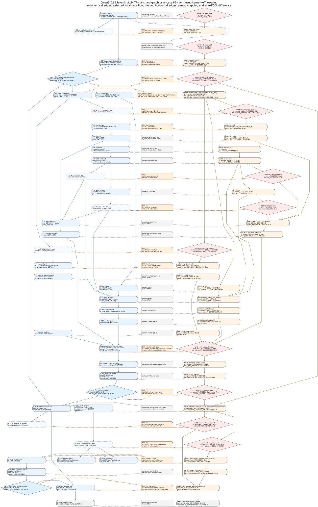

# Qwen3-0.6B: vLLM TP=16 图和 nncase `fused-kernel=off` 图的差异

这篇笔记回答一个很具体的问题：如果用 vLLM 的
`tensor_parallel_size=16` 去切 Qwen3-0.6B，一层 decoder 大概会形成什么样
的计算图？它和当前 nncase CUDA/Triton PoC 里的
[`qwen3-off-layer0.svg`](qwen3-layer0-fused-modes/qwen3-off-layer0.svg)
为什么长得不一样？从运行效率看，谁的瓶颈在哪里？

结论先放前面：

- vLLM TP=16 是标准 tensor parallel 图：hidden state 在 TP rank 间复制；
  QKV 和 gate/up 用 column parallel；o/down 用 row parallel；每层主要只有
  `o_proj` 和 `down_proj` 两次 TP all-reduce。
- 对 Qwen3-0.6B 这个配置，TP=16 是一个很激进的切法。模型只有 16 个 Q
  heads 和 8 个 KV heads，因此每个 TP rank 只拿 1 个 Q head；KV heads
  因为少于 TP rank 数，会被 2 路复制。
- nncase `fused-kernel=off` 图不是 vLLM 这种 GPU TP 图。它是 nncase
  AutoDistributed/SBP 搜索后暴露出来的 PE-local NUMA 模拟图：中间张量会在
  `(B,S(0))`、`(S(0),B)`、`(B,B)`、`Partial=True` 等布局之间切换，图上有
  很多显式 `gather_reduce_scatter` / `paged_attention` collective 节点。
- 从效率看，vLLM TP=16 的风险是“小模型过度 TP”：小 GEMM、KV 重复、NCCL
  latency；nncase off 的风险是“编译器 NUMA 语义太诚实”：launch 边界和 CCL
  materialization 太多。两者都能解释为什么后续需要 `compute-ccl` / `tile`
  这类融合模式，但优化目标并不相同。

## 证据来源

本地 nncase 实验产物：

- `docs/triton-backend/qwen3-layer0-fused-modes/qwen3-off-layer0.svg`
- `docs/triton-backend/qwen3-layer0-fused-modes/qwen3-off-layer0.md`
- `tests_output/qwen3_reshard_off_probe2/cuda_admission/pe_16/CodeGen/cuda/cuda_meta.json`
- `tests_output/qwen3_reshard_off_probe2/cuda_admission/pe_16/CodeGen/cuda/launch_summary.txt`
- `tests/llm/Qwen/Qwen3-0.6B/config.json`

vLLM 图来自源码推导，不是本机 vLLM profile。当前 venv 没有安装 vLLM，所以
下面的 vLLM 部分是 source-level graph，而不是实测 latency benchmark。
关键源码入口：

- <https://github.com/vllm-project/vllm/blob/main/vllm/model_executor/models/qwen3.py>
- <https://github.com/vllm-project/vllm/blob/main/vllm/model_executor/models/qwen2.py>
- <https://github.com/vllm-project/vllm/blob/main/vllm/model_executor/layers/linear.py>
- <https://github.com/vllm-project/vllm/blob/main/vllm/model_executor/layers/vocab_parallel_embedding.py>
- <https://github.com/vllm-project/vllm/blob/main/vllm/model_executor/layers/logits_processor.py>

Qwen3-0.6B 的本地配置：

| 项 | 值 |
| --- | ---: |
| `hidden_size` | 1024 |
| `intermediate_size` | 3072 |
| `num_attention_heads` | 16 |
| `num_key_value_heads` | 8 |
| `head_dim` | 128 |
| `vocab_size` | 151936 |
| `num_hidden_layers` | 28 |
| `tie_word_embeddings` | true |

## vLLM TP=16 会形成什么图

vLLM 的 Qwen3 层来自 `Qwen3Attention` + 复用 `Qwen2MLP`：

- attention 里用 `QKVParallelLinear` 做 packed `q_proj/k_proj/v_proj`；
- `o_proj` 是 `RowParallelLinear`；
- MLP 里 `gate_proj/up_proj` 合成 `MergedColumnParallelLinear`；
- `down_proj` 是 `RowParallelLinear`；
- embedding 和 tied lm_head 是 vocab parallel。

对应的博客插图可以直接用这张对比图：



这张新图的读法是横向逐行读，而不是先把 attention/MLP 聚成几个大框：

- 左列是 vLLM `TP=16` 单个 rank 会看到的 logical shard 图；
- 中列每一行都是 map/diff 说明，灰色表示同一个逻辑 op 但 layout 不同，橙色表示
  shard 轴、fusion 边界或 CCL 插入点不同；
- 右列保留 nncase `qwen3-off-layer0.svg` 的风格：一个 ordinal 一个节点，粉色
  diamond 就是 `requires_collective=true` 的 CCL/collective boundary；
- vLLM 的 Q/K/V 在源码里是一个 packed `QKVParallelLinear`，图里拆成
  `q_proj/k_proj/v_proj` 三条 logical row，是为了逐项比较 shard 和 CCL 语义。

在 TP=16 下，单个 rank 上的 layer 0 可以写成：

```text
input_ids
  -> VocabParallelEmbedding(local vocab shard)
  -> all_reduce hidden_states [T,1024], replicated on every TP rank

for each decoder layer:
  hidden_states [T,1024] replicated
  -> input RMSNorm, local
  -> QKVParallelLinear, column-parallel
       q_local: [T,128]  = 1 Q head
       k_local: [T,128]  = 1 KV head, KV head is 2-way replicated globally
       v_local: [T,128]  = 1 KV head, KV head is 2-way replicated globally
  -> q_norm/k_norm + RoPE, local
  -> KV cache update, local to this rank's KV shard/replica
  -> Flash/Paged attention, local for this rank's Q head
       attn_local: [T,128]
  -> o_proj RowParallelLinear
       local partial [T,1024]
  -> all_reduce -> attn_out [T,1024], replicated
  -> residual add + post_attention RMSNorm, local
  -> MergedColumnParallelLinear gate/up
       gate_local: [T,192]
       up_local:   [T,192]
  -> SiLU(gate_local) * up_local, local [T,192]
  -> down_proj RowParallelLinear
       local partial [T,1024]
  -> all_reduce -> mlp_out [T,1024], replicated
  -> residual add -> layer_out [T,1024], replicated

final:
  -> final norm, local
  -> vocab-parallel lm_head, local logits [T,9496]
  -> gather/all-gather logits for sampling
```

如果只看左侧 vLLM rank-local 部分，可以简化成：

```mermaid
flowchart TD
  I[input_ids] --> E[VocabParallelEmbedding<br/>vocab shard per rank]
  E --> EA[TP all-reduce<br/>hidden replicated]
  EA --> LN[input RMSNorm<br/>local]
  LN --> QKV[QKVParallelLinear<br/>column-parallel]
  QKV --> Q[q: 1 Q head<br/>[T,128]]
  QKV --> K[k: 1 KV head replica<br/>[T,128]]
  QKV --> V[v: 1 KV head replica<br/>[T,128]]
  Q --> QR[q_norm + RoPE<br/>local]
  K --> KR[k_norm + RoPE<br/>local]
  KR --> KC[KV cache update<br/>local]
  V --> KC
  QR --> A[Flash/Paged attention<br/>local]
  KC --> A
  A --> O[o_proj RowParallelLinear<br/>partial [T,1024]]
  O --> OA[TP all-reduce<br/>attn_out replicated]
  OA --> R1[residual + post RMSNorm<br/>local]
  R1 --> GU[gate/up MergedColumnParallelLinear<br/>[T,192]+[T,192]]
  GU --> SM[SiLU and multiply<br/>local [T,192]]
  SM --> D[down_proj RowParallelLinear<br/>partial [T,1024]]
  D --> DA[TP all-reduce<br/>mlp_out replicated]
  DA --> R2[residual add<br/>layer_out replicated]
```

这个图有一个容易忽略的点：TP=16 正好等于 Q head 数，但大于 KV head 数。
vLLM 的 `QKVParallelLinear` 在 `tp_size >= total_num_kv_heads` 时让每个 rank
至少持有 1 个 KV head，并记录 KV head replica 数。对 Qwen3-0.6B：

| 项 | 全模型 | TP=16 每 rank |
| --- | ---: | ---: |
| Q heads | 16 | 1 |
| KV heads | 8 | 1, 但全局 2 路复制 |
| Q projection width | 2048 | 128 |
| K projection width | 1024 unique | 128 per rank, aggregate 2048 |
| V projection width | 1024 unique | 128 per rank, aggregate 2048 |
| gate width | 3072 | 192 |
| up width | 3072 | 192 |
| down input width | 3072 | 192 |
| vocab logits | 151936 | 9496 |

所以 TP=16 下的 QKV projection 从全模型语义上的
`2048 + 1024 + 1024 = 4096` 输出宽度，变成跨 16 rank 实际执行的
`2048 + 2048 + 2048 = 6144` 输出宽度。它不是结果错了，而是 K/V 为了让每个
Q-head rank 能本地跑 GQA attention，被复制了。

## nncase `fused-kernel=off` 图在做什么

当前对照图是：


这个图来自 nncase CUDA/Triton PoC，不是多 GPU vLLM。这里的 `PE=16` 是模拟
NPU/NUMA PE 的数量，`gather_reduce_scatter` 是 generated runtime 显式执行的
collective/reshard 语义。

从 `cuda_meta.json` 读出的 layer0 范围是 `main_segment_1_prim` ordinal
`0..33`。静态 launch 结构如下：

| 指标 | `fused-kernel=off` |
| --- | ---: |
| `pe_count` | 16 |
| ord `0..33` launch 数 | 34 |
| `requires_collective=true` launch 数 | 11 |
| `boxing` | 2 |
| nested `function` | 15 |
| `compute` | 5 |
| `matmul` | 3 |
| `collective` | 9 |

11 个 collective/通信边界是：

```text
ord00 tensor_load
ord02 tensor_load
ord04 gather_reduce_scatter   embed (B,S0) -> (S0,B)
ord06 gather_reduce_scatter   normed hidden (S0,B) -> (B,B)
ord11 gather_reduce_scatter   cos table (S0,B) -> (B,B)
ord13 gather_reduce_scatter   sin table (S0,B) -> (B,B)
ord16 gather_reduce_scatter   normed hidden (S0,B) -> (B,S0)
ord24 paged_attention         collective attention over KV cache
ord27 gather_reduce_scatter   o_proj partial reduce/scatter
ord29 gather_reduce_scatter   residual1 materialization
ord30 gather_reduce_scatter   post_norm materialization
```

它的核心特征不是“把权重平均切给 16 张 GPU”，而是“让编译器选择每个中间值
应该怎么分布”。例如：

- embedding gather 后得到 `(B,S(0))`，随后 ord04 显式 reshard 到
  `(S(0),B)`；
- hidden state 很多时候是 sequence-sharded；
- Q path 需要把 normed hidden materialize 成 `(B,B)` 才方便做 q_proj；
- Q path 的 cos/sin 需要 all-gather，因为 Q 被 head-sharded 后每个 PE 需要
  完整 sequence 的 RoPE 表；
- `o_proj` 产生 `Partial=True`，再通过 reduce-scatter 变回后续需要的布局；
- residual/post-norm/MLP 之间又有额外 materialization。

## 逐项对比

新图里每一行都对应一个 vLLM logical op 和一个 nncase ordinal。最关键的不同点如下：

| 图中位置 | vLLM TP=16 | nncase `off`, PE=16 | 差异 |
| --- | --- | --- | --- |
| input ids / mask | token positions 复制到各 TP rank；mask 更多是 runtime metadata | ord00/ord02 分别 load 成不同 SBP；ord01 显式 mask | nncase 把输入布局和 mask 都落成图节点 |
| embedding | vocab shard，local lookup 后 TP all-reduce 得 `[T,1024]` replicated hidden | ord03 embed 后 ord04 all-to-all `(B,S0) -> (S0,B)` | vLLM 用 vocab parallel；nncase 用 hidden/SBP reshard |
| input norm + K | RMSNorm 后 packed QKV 的 `k_proj` 是一个 logical shard，KV head 2 路复制 | ord05 融合 materialize、input_layernorm、`k_proj` | nncase 融合边界和 vLLM logical op 边界不同 |
| Q path | hidden 已复制，`q_proj` 前没有 CCL；每 rank 1 个 Q head | ord06 all-gather hidden，ord07 输出 `(B,S0)` Q | nncase 为 q_proj 选择了显式 all-gather |
| RoPE | cos/sin 在每个 TP rank 本地可得 | ord11/ord13 分别 all-gather cos/sin | nncase 序列/布局选择导致 RoPE 表也有 CCL |
| V path | `v_proj` 前没有 CCL；每 rank 1 个 replicated KV head | ord16 all-to-all 到 `(B,S0)`，ord17 matmul partial | nncase 在 V matmul 前插入 reshard |
| attention | 本地 Q head 直接用本地 K/V replica；attention 路径无 TP CCL | ord24 是 collective `paged_attention` | vLLM 用 KV 复制换掉 attention 通信 |
| o_proj | row parallel local partial 后 TP all-reduce，输出重新 replicated | ord26 partial，ord27 reduce-scatter 到 `(S0,B)` | 都处理 partial，但 CCL 形态不同 |
| residual/post norm | residual1 和 post_norm 仍是 replicated hidden | ord29/ord30 分别 all-gather residual1/post_norm | nncase 中间 materialization 更多 |
| MLP | gate/up local shard，down local partial 后 TP all-reduce，再做 residual | ord31 融合 gate/up/act/mul；ord32 partial；ord33 消费 partial | vLLM 在 residual 前规约；nncase 把 partial 延到边界消费 |

把上面的逐 op 差异收束成系统层面，就是这几条：

| 维度 | vLLM TP=16 | nncase `fused-kernel=off`, PE=16 |
| --- | --- | --- |
| 并行语义 | 多 GPU tensor parallel | 单 CUDA target 上模拟 16 个 PE/NUMA 分区 |
| hidden state | 每个 TP rank 都有完整 `[T,1024]` | 在 `(S0,B)`、`(B,B)`、`(B,S0)`、`Partial=True` 之间切换 |
| 每层主要通信 | `o_proj`、`down_proj` 两次 TP all-reduce | layer0 ord0..33 有 11 个 `requires_collective` 边界 |
| 性能风险 | TP 过细、小 GEMM、KV 重复、NCCL latency | launch 太碎、CCL materialization 多、GPU-native 融合不足 |

## 效率分析

### 1. TP=16 对 Qwen3-0.6B 太细

Qwen3-0.6B 只有 16 个 Q heads。TP=16 后，每 rank 只有 1 个 Q head，Q projection
本地输出宽度只有 128；MLP 的 gate/up 本地宽度也只有 192。对 decode 或小 batch
场景，这些 GEMM 很容易变成“小矩阵 + 高调度开销”的形态。

这不是 vLLM 的实现问题，而是模型规模和 TP 粒度的匹配问题。TP=16 对更大的
模型可能合理；但对 Qwen3-0.6B，TP=8 往往更自然：8 个 KV heads 可以一 rank
一个，不需要 K/V 复制；每 rank 也有 2 个 Q heads，GEMM 粒度更大。

### 2. KV head 复制换掉了 attention 通信

vLLM 选择在 `KVH < TP` 时复制 KV heads。这样每个 Q-head rank 可以直接用本地
K/V cache 跑 attention，不需要为 attention 做跨 rank gather。但代价是：

- K projection 和 V projection 的 aggregate 计算从 8 个 KV heads 变成 16 份
  KV-head work；
- KV cache aggregate 存储也按 rank 复制，多出 2 倍 KV-head 副本；
- 每个 rank 本地更简单，跨 rank 通信集中在 row-parallel linear 的 all-reduce。

这是一种典型的服务框架取舍：多做一点 K/V 相关计算和存储，换掉 attention
路径上的复杂通信，让 serving runtime 更稳定。

### 3. vLLM 每层通信少，但通信是 NCCL/TP 语义

一层 decoder 里最稳定的两次 TP collective 是：

- `o_proj`: local `[T,128] x [128,1024] -> partial [T,1024]`，然后 all-reduce；
- `down_proj`: local `[T,192] x [192,1024] -> partial [T,1024]`，然后 all-reduce。

按 fp16 粗略估算，每次 all-reduce 的逻辑 payload 是 `T * 1024 * 2` bytes。
ring all-reduce 每 rank wire traffic 约为 `2*(15/16)` 倍 payload。两次合计约
`7680*T` bytes/rank/layer。这个带宽量本身不夸张；真正容易伤性能的是每层两次
跨 GPU 同步的 latency，尤其是小 batch decode。

吞吐量上可以粗略判断：如果是成熟 GPU serving runtime，vLLM 的图通常会明显强
于当前 nncase `off` 图，因为它把一层里的同步点压到很少，并且 attention/采样路径
已有工程化 kernel。但这不等于 `TP=16` 对 Qwen3-0.6B 是最优切法。这个模型太小，
TP=16 后每 rank 的 GEMM 宽度只有 `128/192` 级别，decode 场景很容易被 launch
和 NCCL latency 吃掉；实际更可能是 TP=4 或 TP=8 更平衡。

### 4. nncase off 的问题是 launch 和显式重排太多

本地 `off` 图暴露出 34 个 ord launch 边界，其中 11 个需要 collective。这些
边界非常有利于解释编译器做了什么，但对 GPU 效率并不好：

- 很多小 elementwise、transpose、copy、RoPE、layernorm 被拆在不同 helper 里；
- CCL materialization 在图上非常清晰，但也意味着额外 kernel launch 和读写；
- PE-local NUMA 语义保留得越完整，越容易偏离 GPU 原生的 flat-memory/fused-kernel
  执行方式。

所以 `off` 图适合做正确性和机制展示，不适合代表最终性能上限。

这里还要注意通信量不能直接按 vLLM 的 NCCL wire traffic 去和 nncase 的 PE-local
CCL 对比。vLLM 的 TP CCL 是跨 GPU/rank 同步；nncase 当前 PoC 的 CCL 是在一个
CUDA target 内显式模拟 PE/NUMA 布局。更公平的比较是“同步点数量、materialization
次数、以及这些边界是否能被融合”。按这个口径，`off` 模式明显吃亏。

### 5. 为什么这支持 `compute-ccl` / `tile` 方向

从对比可以看出，vLLM 和 nncase 当前 PoC 的优化方向不同：

- vLLM 已经有高度工程化的 GPU serving runtime，图层面简洁，通信点少；
- nncase 当前保留了完整分布式 IR 和 PE/NUMA 语义，图层面更“编译器可解释”，
  但 launch/CCL 代价高。

因此 nncase 后续优化不应该简单模仿 vLLM TP=16。更合理的目标是：

- 保留 AutoDistributed/SBP 的可解释决策；
- 把相邻 elementwise、layout、RMSNorm、RoPE、residual、MLP 片段融合掉；
- 让 CCL-adjacent 的生产/消费尽量在同一个 persistent/tile kernel 内完成；
- 对 paged attention、KV-cache update 这种有副作用的边界保持保守，先不要强行
  和所有东西揉成一个巨核。

换句话说，vLLM 告诉我们“成熟 GPU serving 图应该把跨 rank 通信点压得很少”；
nncase off 图告诉我们“当前编译器语义还暴露了太多中间重排”。二者之间的差距，
正是 `compute-ccl` 和后续 `tile` mode 要缩小的空间。

## 博客可用的中心论点

可以把文章写成这样：

1. 先展示 `qwen3-off-layer0.svg`：它不是普通 PyTorch/vLLM execution graph，
   而是一个把 SBP、Partial、collective 都摊开的编译器图。
2. 再给 vLLM TP=16 的 rank-local 图：embedding all-reduce，QKV column
   parallel，attention local，o/down all-reduce。
3. 解释 Qwen3-0.6B 的特殊性：`QH=16, KVH=8, TP=16` 导致每 rank 一个 Q head，
   KV heads 2 路复制。
4. 得出效率判断：vLLM 图通信少但 TP 粒度过细；nncase off 图语义完整但 launch
   和 collective 太多。
5. 引出优化路线：nncase 的价值不在于复刻 vLLM，而在于让图编译器的 SBP 决策
   逐步下沉到更少、更粗、更 persistent 的 CUDA/Triton kernel 中。

## 复查命令

本地复查 Qwen3 配置：

```bash
jq '{hidden_size,intermediate_size,num_attention_heads,num_key_value_heads,head_dim,vocab_size,num_hidden_layers,tie_word_embeddings}' \
  tests/llm/Qwen/Qwen3-0.6B/config.json
```

本地复查 `off` 图的 layer0 launch/collective 数：

```bash
python - <<'PY'
import json
from pathlib import Path

p = Path("tests_output/qwen3_reshard_off_probe2/cuda_admission/pe_16/CodeGen/cuda/cuda_meta.json")
data = json.loads(p.read_text(encoding="utf-8-sig"))
funcs = {f["name"]: f for f in data["functions"]}
launches = funcs["main_segment_1_prim"]["launches"]
layer0 = [x for x in launches if 0 <= x["ordinal"] <= 33]
collectives = [x for x in layer0 if x["requires_collective"]]

print("pe_count", data["pe_count"])
print("fused_kernel", data["fused_kernel"])
print("ord0..33 launches", len(layer0))
print("requires_collective", len(collectives))
print([(x["ordinal"], x["kind"], x["op_name"]) for x in collectives])
PY
```

复查 upstream vLLM TP 图入口：

```bash
curl -L --silent https://raw.githubusercontent.com/vllm-project/vllm/main/vllm/model_executor/models/qwen3.py |
  nl -ba | sed -n '59,162p'

curl -L --silent https://raw.githubusercontent.com/vllm-project/vllm/main/vllm/model_executor/models/qwen2.py |
  nl -ba | sed -n '83,117p'

curl -L --silent https://raw.githubusercontent.com/vllm-project/vllm/main/vllm/model_executor/layers/linear.py |
  nl -ba | sed -n '1015,1062p'
```
